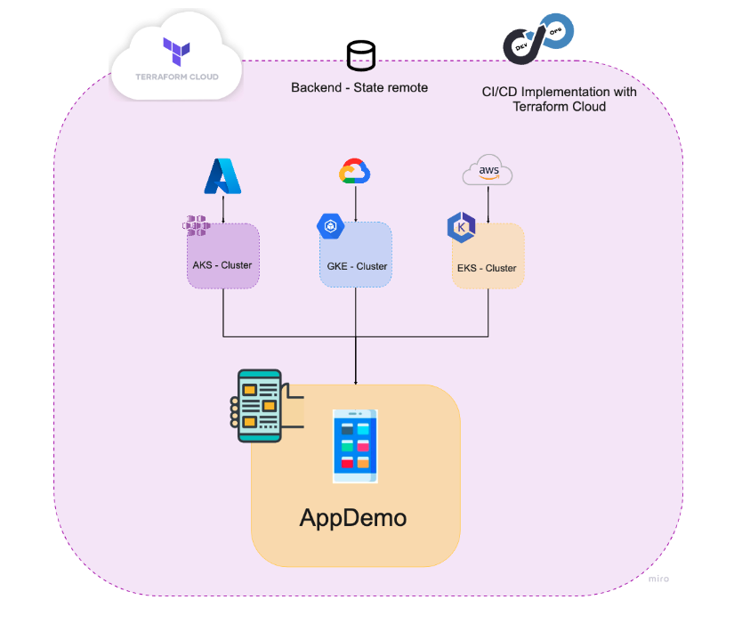

# TechM University pre-project challenge 🚀

## What is this? 🤔
Hi! This is a challenge for al of those recently graduated trainees who are waiting to be assigned to their next project 🦾

## Prerequisites 🤓

In order to start with these challenges, it is necessary that you have previously completed the following assignments: 📌

- GCP cloud digital leader certification
- AWS learning path
- Terraform learning path
- Vault learning path
- kubernetes learning path

---

## First steps ⚡️

1. Fork this repository and clone it to your local machine.
2. Once you have it, you will be hosting the files for each challenge within their respective folders:
	- [challenge 1](/challenge_1/)
	- [challenge 2](/challenge_2/)
	- [challenge 3](/challenge_3/)
	- [challenge 4](challenge_4/)
3. Once you complete the challenge, you will be able to push your changes to the repository and add @MarioRoblesDOU to the list of collaborators.	

---
## Challenge 1: Terraform Multicloud Deployment 💪


Trough modules and variables, you will deploy a customizable multi-cloud environment using Terraform.

You will be deploying a web application on the 3 principal cloud providers (GCP, AWS and Azure) a kubernetes cluster using Terraform, go to the [demo app](/demo_app/) folder and follow the instructions to deploy it on a kubernetes cluster📖

For more information and documentation, you can visit these official resources:
- [Terraform documentation](https://learn.hashicorp.com/terraform)
- [Demo app offical app](https://microservices-demo.github.io/)

### Deliverables 📌

 - a README.md file with the documentation of your solution.
 - a video demo explaining the solution.
 - a screenshot of the demo app running in each cloud provider.

---
## Challenge 2: Vault with k8s and Helm💪


The principal Kubernetes services can run Vault in its secured and managed Kubernetes service in standard or autopilot mode. Standard mode gives you the flexibility to configure the cluster's underlying infrastructure while autopilot mode gives you an optimized cluster with a hands-off experience.

In this challenge, you will create a cluster in GKE, EKS and AKS on Terraform, install Vault in high-availability (HA) mode via the Helm chart and then configure the authentication between Vault and the cluster. Then you will deploy a web application with deployment annotations so the application's secrets are installed via the Vault Agent injector service.

For more information and documentation, you can visit these official resources: 
- [Vault GKE documentation](https://learn.hashicorp.com/tutorials/vault/kubernetes-google-cloud-gke?in=vault/kubernetes)
- [Vault AKS documentation](https://learn.hashicorp.com/tutorials/vault/kubernetes-azure-aks?in=vault/kubernetes)

- [Vault EKS documentation](https://learn.hashicorp.com/tutorials/vault/kubernetes-amazon-eks?in=vault/kubernetes)

### Deliverables 📌

 - a README.md file with the documentation of your solutions.
 - a video demo explaining the solutions.
 - a screenshot of the demo app running in each cloud providers.

## Challenge 3: Vault Multicloud deployment💪


In this challenge, you will deploy a Vault Server on Google Compute Engine, Amazon EC2, and Azure VM, using Terraform, Ansible roles and Hashicorp Packer.

Outside of development mode, Vault servers are configured using a file.

Your Vault configuration must have:

- Storage backend in each of the cloud providers (SA for Azure, S3 for AWS and GCS for GCP)
- UI enabled and rechable from the public internet
- Vault must be in prod mode (sealed)

Once you have your Vault server up, unseal it and enable a KV secret engine and put this secret:

``` json
	"Hello":"World!"
```

For more information and documentation, you can visit these official resources:
- [Vault Storage Backend Configuration](https://www.vaultproject.io/docs/configuration/storage)
- [Vault General Documentation](https://learn.hashicorp.com/vault)

### Deliverables 📌

 - a README.md file with the documentation of your solutions.
 - a video demo explaining the solutions.
 - a screenshot of the Vault UI running in each cloud providers.
 - Probe of the Vault storage backend in each cloud provider.

---
## Challenge 4: Terraform Cloud Infrastructure ☁️



This challenge consists of deploying:
- Terraform infrastructure with Terraform Cloud. 
- Apply CI/CD process automation for each change that is made in the infrastructure 
- Use a remote state. 
- Apply the VCS model for this challenge.
- Use a kubernetes cluster to deploy the application and verify that your infra is correct, loaded and working. 

>For testing purposes you can deploy any smaller resources just to test if the infrastructure is working. 

### Deliverables 📌

- README.md file with the documentation of your solutions.
- Video demo explaining the solutions.
- Screenshot of the demo app running in each cloud providers.
- Workspace connected via VCS
- Remote Backend
- CI/CD runners (push executable - Desirable: with at least 2 branches except main) (to be executed automatically as soon as a push is performed)

For more documentation, you can visit these official resources:

- [Terraform Cloud documentation](https://learn.hashicorp.com/collections/terraform/cloud-get-started)
- [UI/VCS Run workflows](https://www.terraform.io/cloud-docs/run/ui)
- [Connecting to VCS](https://www.terraform.io/cloud-docs/vcs)
- [Configuring VCS connections](https://www.terraform.io/cloud-docs/workspaces/settings/vcs)
- [State in Terraform Cloud](https://www.terraform.io/cloud-docs/workspaces/state)
  
  
### Optional quiz  🤨

- How does terraform cloud work?
- What is the main purpose of using terraform cloud?
- In which cases would be good to use variable sets? 
- What are the main differences between using CLI, VCS, API, etc.?
  

### Expose external IP with Load Balancer 💻

To check if your application is working, we need to connect to an external IP that is exposed through a NodePort, LoadBalancer or Ingress.

With this command you can connect a LoadBalancer to the NodePort that is created with the complete-demo manifest.
Just enter the IP that is exposed and the port that has been assigned to the NodePort.

```bash
kubectl expose deployment "Your deployment name" --type=LoadBalancer --name="Change this" -n "your name space"
```
