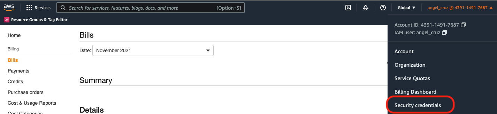
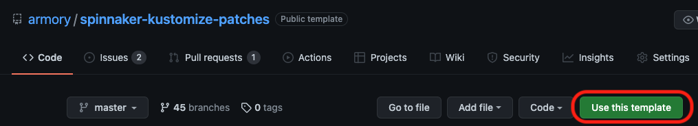
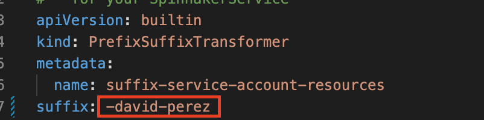

# Armory Professional Services Onboarding / Training 

## Prerequisites

```shell
brew install kustomize
brew install kubectl
brew install awscli
```

## For GCP
[GCP Setup Guide](gcp/README.md)

## AWS

### Create AWS user

Send a pull request to create your aws username  
https://github.com/DigitalOnUs/armory-terraform-users

### AWS Console  

https://439114917687.signin.aws.amazon.com/console

### Create access key  

User tab / Security credentials / Create access key  
  
> :warning: save your access and secret keys, you can see them only once

### Create AWS profile  

create the file `~/.aws/credentials` and add your access key

```properties
[tm]
aws_access_key_id     = XXXXXXXXXXXXXXXXX
aws_secret_access_key = xxxxxxxxxxxxxxxxxxxxxxxxxxxxxxxxxxxxxxxxxxx
```

to verify yor credentials you can list the s3 buckets
```shell
# to list all the s3 buckets
aws s3 ls --profile tm
```

### Create kubeconfig from eks

```shell
aws --profile tm --region us-west-2 eks update-kubeconfig --kubeconfig ~/.kube/tm.yaml --name armory-spinnaker-dev --role-arn arn:aws:iam::439114917687:role/eks-developers
```

Verify kubernetes connection
```shell
# to list all the k8s namespaces
kubectl get ns --kubeconfig ~/.kube/tm.yaml
```
or
```shell
# to list all the k8s namespaces
KUBECONFIG=~/.kube/tm.yaml kubectl get ns
```

[Kubernetes cheat sheet](https://kubernetes.io/docs/reference/kubectl/cheatsheet/)

## Install Spinnaker

### Spinnaker Operator

It is already deployed in `spinnaker-operator` namespace

### Spinnaker Kustomize Patches

Generate template and clone the repo  
https://github.com/armory/spinnaker-kustomize-patches



> It is important not to expose sensitive information, you can consider keeping the repository private.

delete `kustomization.yml` file
```shell
rm kustomization.yml
```

create symlink for minimum
```shell
ln -sf ./recipes/kustomization-minimum.yml kustomization.yml
```

create your own namespace
```shell
kubectl create ns <your-name>-spin --kubeconfig  ~/.kube/tm.yaml
```

use your namespace in `kustomization.yml` file

you can set spinnaker armory version in core/patches/version.yml we recomend to use [Armory most recent version](https://docs.armory.io/armory-enterprise/release-notes/rn-armory-spinnaker/)

Edit the suffix in `utilities/unique-service-account.yml` file:  

- rename `suffix` from `-my-suffix-changeme` to `-<firstName-LastName>`

Example:
  

you can comment the line `- accounts/docker/patch-dockerhub.yml` in `kustomization.yml` file (optional)

Create the secrets
```shell
cd secrets
KUBECONFIG=~/.kube/tm.yaml ./create-secrets.sh <your-namespace>
```

go back to the root folder

Build spinnaker kustomize patches
```shell
kustomize build .
```

Apply spinnaker kustomize patches
```shell
kustomize build . | kubectl --kubeconfig ~/.kube/tm.yaml apply -f -
```

Check spinnaker pods
```shell
kubectl get pods --kubeconfig ~/.kube/tm.yaml -n <your-namespace>
```

To open the ui, you need to port forward deck and gate services
```shell
kubectl port-forward -n <your-namespace> svc/spin-deck 9000:9000 --kubeconfig ~/.kube/tm.yaml
kubectl port-forward -n <your-namespace> svc/spin-gate 8084:8084 --kubeconfig ~/.kube/tm.yaml
```

> Deck is the UI and depends on Gate to interact with Spinnaker services.

now you can open Spinnaker in your browser with http://localhost:9000/

To delete your spinnaker instance
```shell
kustomize build . | kubectl --kubeconfig ~/.kube/tm.yaml delete -f -
```

# The following sections are not related to spinnaker installation

## Repositories  
https://github.com/orgs/DigitalOnUs/teams/armory-professional-services/repositories


# Installation of extra tools
## [Telepresence](telepresence/README.md)
## [Local installation of OSS](local-spinnaker-oss/README.md)
## [Monitoring Spinnaker](monitoring-spinnaker/README.md)

# Armory PS Projects
## [Projects](projects/README.md)
