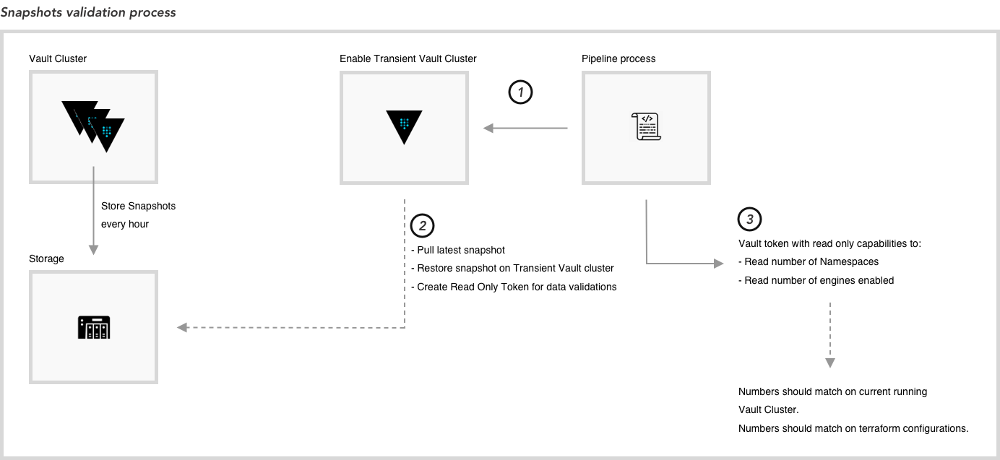

# Backup and Restore process

Any production system should include a provision for taking regular backups. Vault Enterprise can be configured to take and store snapshots at a specific interval.

Workflow for Vault snapshot backup and validation.



### **Backup Setup**

- **Automated process**

    - Backup configuration is described in the following: https://www.vaultproject.io/api-docs/system/storage/raftautosnapshots

    - Backups will be taken automatically on a timely basis and stored based on the snapshot configuration.

        - Takes a snapshot of the Vault data. The snapshot can be used to restore Vault to the point in time when a snapshot was taken.

- **For Testing purposes**

    ```
    Usage: vault operator raft snapshot save <snapshot_file>

    Saves a snapshot of the current state of the Raft cluster into a file.

        $ vault operator raft snapshot save raft.snap
    ```


### **Backup Validation**

- Enable a transient vault cluster using IaC.

- Pull latest snapshot and install it on the transient vault cluster.

- Install latest snapshot.

```
Usage: vault operator raft snapshot restore <snapshot_file>

  Installs the provided snapshot, returning the cluster to the state defined in it.

      $ vault operator raft snapshot restore raft.snap
```

- Validate data restored into the vault cluster.

    - If Primary cluster is up and running cross check data from primary vault cluster and transient vault cluster.
    - If Primary cluster is down cross check with terraform code if vault provisioning is handled by vault terraform provider.

- Destroy Transient Vault cluster once snapshot has been validated.

NOTE: ACL Polices and Tokens for this activity should be taken in consideration by the security team or vault administrators to perform this activity and avoid using vault root token to access and read data.

### **Restore process**

- if Primary was broke, first it is necessary to have a healthy cluster.
- Once having a healthy cluster, select the snapshot file validated to be restored.
- Restore data using: 
    ```
    Usage: vault operator raft snapshot restore <snapshot_file>

    Installs the provided snapshot, returning the cluster to the state defined in it.

        $ vault operator raft snapshot restore raft.snap
    ```
