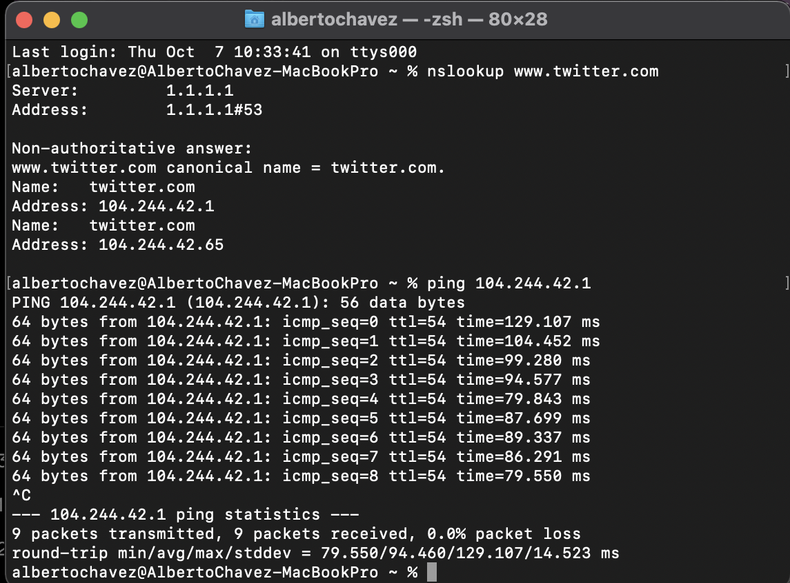
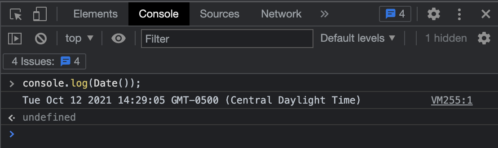
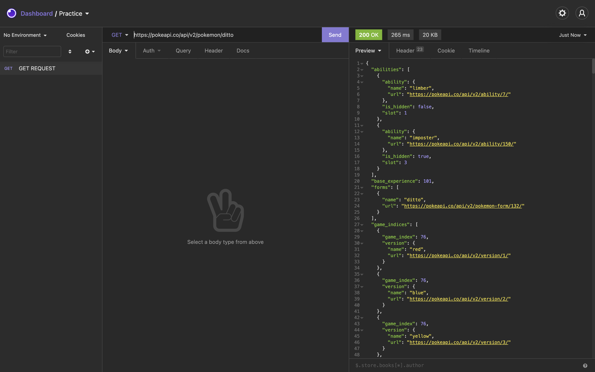

# DNS
## What are DNS
DNS are large databases that links different ips to a meaningful name, so it can be accessed in a simpler way.

## What theya are good for?
DNS helps us to either move across the internet or send different types of messages such as emails.

## What data structure does they use to wokr?
DNS works in different ways, it's usually a map of different ips

## Types of registers that exists for DNS
- WWW
- email
- messaging apps

### Ping to website
The process was simple, due to use of DNS in every webpage I needed to find out which was the ip from certain website, in this case Twitter, so I typed 'nslookup' and the address on the console, so a list of data could be displayed, here I found out the IP so I could ping and start receiving packages.

# Web browser
## What are browsers?
Browser are the tools that render all the information stored in a web page so this could be display.

## What are web browsers extensions?
A series of tools that give special features to a web browser

## What is web scrapping?
Is a technique used by developers to collect information a cross different web sites.

## 4 Web browsers
- Opera
- Google Chrome
- Mozila firefox
- Safari

## V8 in Chrome
It's an engine developed by Google, it's main goal it's to compile Javascript code.

## What language does a browser use?
Some of them, like Chrome, use javascript, you can even type some code on the console and it will run with no problem, and mostly HTML.

## Explore console and date

# HTTP
## What is HTTP?
Is one of the main protocols to transfer data across the internet

## Other communication protocols
- HTTPS (improved version of HTTP)
- UDP
- FTP
- TCP

## Protocol that web browsers understand
- WWW
- DNS
- HTTP/HTTPS

## Request and response
Http works on a command-response text, what we do is a request to the server, this request consists of information that will be displayed later, the response is the answer to that request, but this could vary depending of certain factors, at it will either be successful or a denial.

## Status 200
The status 200 indicates that a request hasa been successful

## Status 400 and 404
The status 400 tells us that the request has failed due to different reason, by the other hand, 404 is an indication that either an element or the site itself does not exist

### Write a get request
The exercise was simple, this time I used the PokeApi to recive some data so the get request was easier to understand, I used Insomnia so I could check the data and the status, which was 200, that means it was successful.

# Accesibility
There are different types of accesibiltiy in the web, it can either be a correct use of HTML components so other developers can understand on a better way what they are reading, but it goes further than that, accesibility can also mean a good design so that everyone can properly use our webpage

## How to achieve it in web?
- Use headings correctly to properly organize the content
- Include the property alt text in img 
- Give to the links unique and especififc names
- Learn how to choose your colors 
- Desing bette forms
- Use table only for data not layout
- Be sure that the content can be accessed with the keyboard

## Who is going to read the accesibility and how it interacts with the browser?
Mainly as developers, the accesibility could help us to make improvements or changes when they are needed on a better way and it help us to understand the structure of the page, by the other hand users are teh main focus of the accesibitlity, at the end they are the ones that spend most of the time using our web...

# HTML and CSS basics
## What's HTML?
HTML is an specific language for building web pages, it's based on tags which represent every element of our page, like "body", "head", or even some especific blocks like "div", in other words, HTML is the skeleton of every web.

## What's CSS?
CSS is what will helps us to boost our page, giving different styles to every component that we have.

## What are selectors?
Selectors are the way CSS tells to the HTML file which style should be applyed to certain components, we can do it by elements, in this case if we give some properties to an h1 this will apply to every single one, or we can create a class, which will containt properties for elements that are part of the same class, this ones does not have to be the same element, and finally id, which is similar to a class but only applys for one element.

## What is the basic structure of HTML?
- First we declare the doctype, which will tell the browser that is HTML5
- After that we add the tag html which is the root of our project
After this everything get tricky, the next elements could be added or not, it actually depends of every developer, but we would have good practices and we will implement them the right way
- We need to add a head, this will contain the information about the page, like styles, frameworks and so on.
- Then the title, which will be displayed in the tab of the browser
- And finally the tag body, this will contain all of the elements that we will add to our web, such as h1, p, table, and more. 

## What is HTML5?
Is the latest version of HTML, it improves all the things that we could previously do, like adding media without flash player, we can even create apps in our web.

