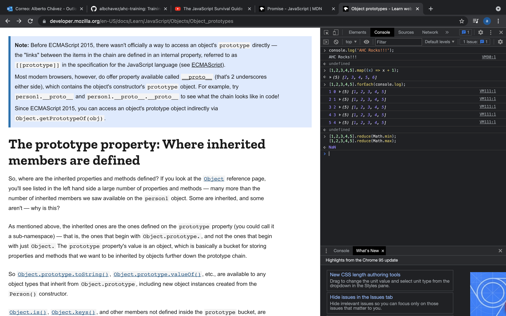

# Week 3
## JS basics
### what is an array?
An array is a reserved space of memory where we store data. In JS arrays work differently than in other languages, they actually are "lists", we do not need to define a size for them, and we can even add or remove elements as we please and the array will re-arrange itlsef.

### what is an object in js?
An object in JS is basically an unordered collection a key-value data.

### what is the prototype and classes and how they are different?
- Prototypes are the way objects inherit properties.
- As many other languages, classes are the blueprint of objects, they the define how they will  work and the values that they will have.
The main difference is that classes are built upon the prototype object, turning them into special functions, not classes as in Java.

### what are let, const and var and what are their differences?
- var is the basic way of declare variables and they can be accessed across the whole file.
- let is similar to var, the difference is that it is attached to it's scope and it cannot be used outside of it.
- const as let can only be accessed on it's scope but it cannot be modified, it is unmutable.

### what is a promise?
Promises are eventual asyncronus actions that could or could not take place, and return a value. They help us to perform certain actions either if our request is a success or failure.

### what is undefined and null values for?
- undefined is the default value that a variable has if there's nothing assigned to it.
- null represents an empty value but it needs to be assigned explicitly.

### what is the scope of a variable?
Is the block of code where the variable can be accessed to.

### explain very simple the event loop?
The event loop is the one in charge of exectue all the tasks that we declare on our code.

### what is a constructor?
A constructor is an special method where we set initial values for an object.

* write a piece of code on how you add values to an array at the end?
```
	const array = [];
    array.push('world');
```
* write a piece of code on how you add values to an array at the beggining?
```
	array.unshift('Hello');
```
* write how do you reference the last value on an array?
```
	console.log(array[array.length-1]);
```
* write how can you put dinamyc or calculated properties in a dictionary(object)?

### Exercises



## DOM and Fetch API
### What is the dom and what it stands for?
The dom it's the Document Object Model, and it represent a tree of the component that we have on a HTML document, it need a root and it has nodes, every node could have childrens.

### What is event bubbling and event capture?
- capturing is when an event goes beyond the element it was meant for and it's spread across it's childrens.
- Bubbling is the opposite way, it spread the element from the children to the root element.

### What data structure the dom uses?
Trees

### What is the fetch api?
Fetch is the common name for a request and it's response, when we fetch an API we do a request to certain URL and this will give us a response, which returns some resource.

### What is a promise?
It's an action that will be executed at some point and could or could not be successful.

# ES6
## How a function can receive optional parameters?
```
	const myFunction = (name='John', lastName='doe') => { 
        return `${name} ${lastName}`;
    }
```
## What are template literals?
It's an special way to declare a string, it goes surrounded by `` and we can add different vars with out concatenating them.

## What are tagged templates?
With templates we add variables to a template literal on a more readable way "${var}"

## What are arrow functions, what happens if the arrow function has no body?
These are special functions that need to return a value. They are also know as lambas.
- When an arrow function is empty (actually with every function), JS wil return undefined, as it is the default vars and functions that doesn't have an specific value.

## What is destructuring in js?
It's a way of extract elements from arrays or objects, and assing them to specific vars.

## What is async and await words for?
Async and await are just another way of doing promises. Every time we want to do a promise with await, our functions needs to be async so it could work.

### Write how would you combine the following 2 texts in 2 different variables 
- first has const x1 = 'Hey dude!';
- second has const x2 = 'You are awesome!';
```
    const combined = ` ${x1} ${x2}`;
```
### Write how would you destructure the following array in 3 variables [1,2,3],
```
    const num = [1,2,3];
    const [x,y,z] = num;
```

### If you are exploring the following object
```
	{
		person: {
			name: 'John',
			age: 20
		}
	}
```
### Trought destructuring how do you get the name?
```
    const {name} = person;
```

### Write a very simple api fetch call using async and await
```
    async function f() {

        let promise = new Promise((resolve, reject) => {
            setTimeout(() => resolve("done!"), 1000)
        });

        let result = await promise; // wait until the promise resolves (*)

        alert(result); // "done!"
    }
```
