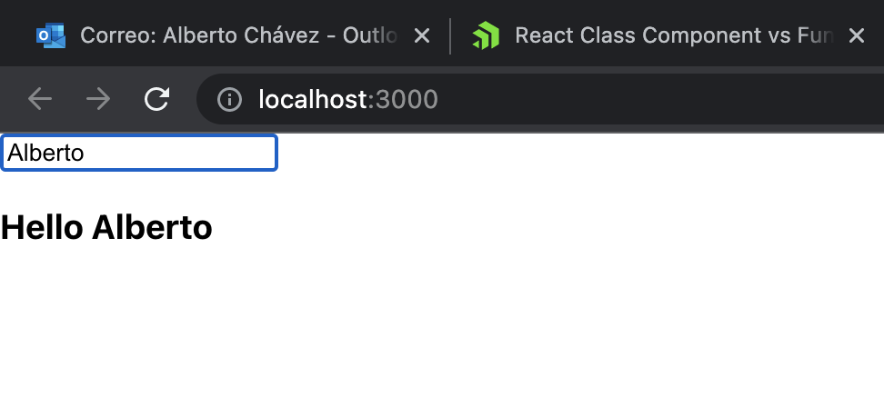
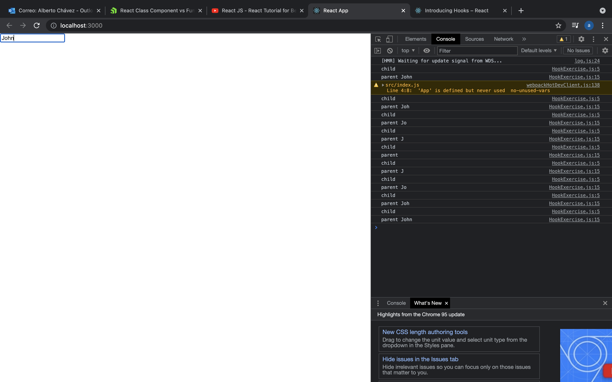
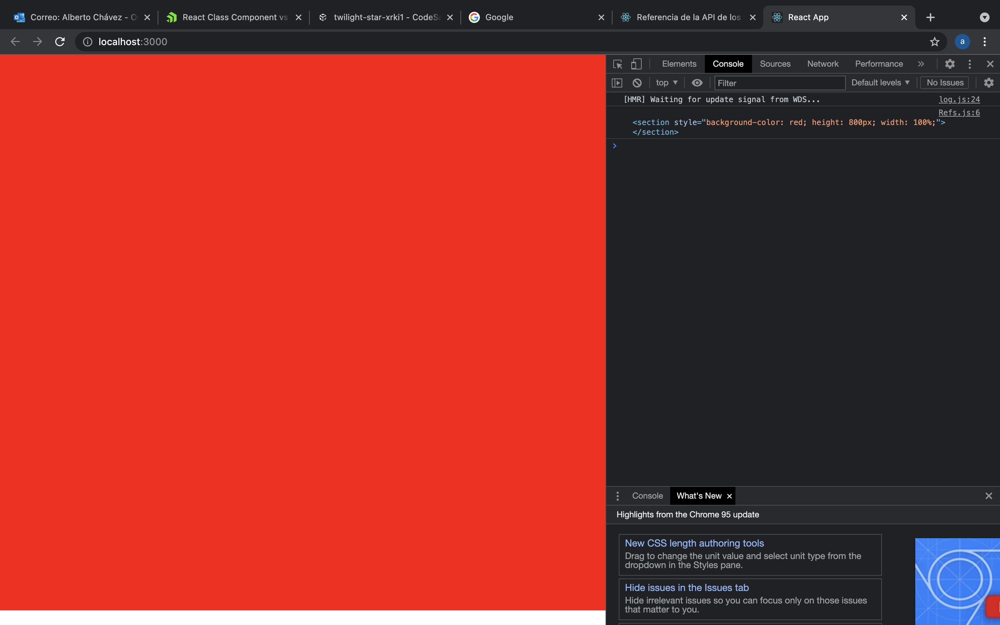

# Week 5
## React fundamentals
### What is react?
React is a JS library that let's us create different UI based on single components. 

### What is the virtual DOM?
The react DOM is basically a copy from the original DOM, where our code will be working on, as the other features that react  offers.

### What are is lifecycle of a component?
When we are rendering a component this will have a lifecycle during this process, it will be mounted, it can be updated and it can be unmounted, this are the lifecycles of the component and represent it's current state in the DOM.

### How does lifecycle work in class vs functional components?
- In class components we have specific methods for working t=with the lifecycle, such ass ```willUpdate()```
- With functional components we need to work a little bit different, we need to use hte hook ```useEffect()```

### What are class components and functional components?
In react we can create components in two different ways, class and functions
- Class components it's a common JS class but it extends from the ```React.Component``` library
- Functiona components are simplE JS functions that return a component

### What is the state in react and what are props?
The state is an object where we store the data from a component

### What is the display name in a component?

### What is the useState and setState?
- useState is a method that helps us to extract the data stored in the state
- setState is the way we update the state

### What is the flux pattern?
Is an special architecture developed by facebook, and it's used to develop client-side web apps.

### What is one way data flow?
In react all of our data goes on one direction, form parent to child.

### Why is immutability important in react?
The inmutability keeps a record of all of the changes we made, and that we React can keep the state on a more proper way

### Exercise
### What happens when the prop changes?
The component will re-render with a new value in the SayName component.


## Hooks
### What is a hook?
Hooks are special functions that allows us to interact with the state and lifecycle, using functional components.

### What are they used for?
This is where it gets a little tricky, the most common use for hooks is when we are trying to change the state of a component or when we want to play with teh lifecycle, but hooks can go further than that, we can use the to make API calls, do some validations on our props and more.

### How would you write a custom hook and what for?
We can create custom hooks like any other component, for example, if we need to make a lot of API calls with a very similar URL, it would be more useful to create a custom hook, than having to type the same code one in many different files.

### Exercise
Create the following one, use the previous example but this time include a custom hook for managing the name

look at what happens...
- We set the value for name with useState, and everytime we type on the input, a new value will be set an it wil be rendered on the input.

## Refs
### What are refs in functional components?
Refs are objects that return all the props and values that a child has.

### What are dom refs in react?
dom refs are the way we can acces to the DOM itself, and extract the values from different nodes.

### Mention a use case?
A simple one is when we want to focus an input when we click on a button, we create a ref from that input and call it inside the function from the button.

### Exercise
