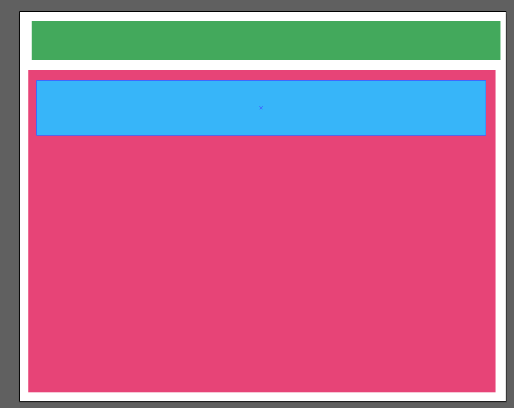

# DOU by Tech Mahindra

## AHC Training Week 2

#### CSS BASICS
#### Pseudo Elements And Pseudo Classes
#### CSS Layouts
#### Responsive design
#### Css frameworks
#### Form Validations

<br/>
<br/>
<br/>
<br/>


### WEEK ALGORITHM

Run-length encoding is a fast and simple method of encoding strings. The basic idea is to represent repeated successive characters as a single count and character. For example, the string "AAAABBBCCDAA" would be encoded as "4A3B2C1D2A".

Implement run-length encoding and decoding. You can assume the string to be encoded have no digits and consists solely of alphabetic characters. You can assume the string to be decoded is valid.

### WEEK EXCERCISE
At the end of the week you must have the following

<br/>


 ### CSS BASICS

#### Questions
* Float position vs display how they work?
* What are selectors what is the selector for tag, class and id?
* You have the following code?
* How would you select the following button and what is the code to make it red, with white text, bordered and also with rounded corners?
```
	<div>
		<button class="my-btn" >Hit me!</button>
	<div>
```

* What are margins and paddings?
* What does it mean that styles are in cascade?


####  References

https://codecoda.com/en/blog/entry/css-selectors-properties-and-values
https://www.w3schools.com/css/css_float.asp
https://www.youtube.com/watch?v=1PnVor36_40


### Pseudo Elements And Pseudo Classes
#### Questions
What are pseudoelements and what is the syntax they use?

What are pseudo classes mention 2 and how to write them?

What is the hover state of an html element and how can you use it for design with css?

#### References 
https://developer.mozilla.org/es/docs/Learn/CSS/Building_blocks/Selectors/Pseudo-classes_and_pseudo-elements

### CSS Layouts
#### Questions

What is flex?

What are the properties flex grow and flex shrink?


#### Excersises

Try to emulate both models in 2 separated files.


#### References 
https://css-tricks.com/snippets/css/a-guide-to-flexbox/
https://developer.mozilla.org/es/docs/Web/CSS/CSS_Flexible_Box_Layout/Basic_Concepts_of_Flexbox


### Responsive design
#### Questions
What is responsive design?

What are media queries?

How does bootstrap manages the media queries or breakpoints?


#### Exercises
Write an html page which has the following layouts 

Phone


Tablet


Web 


#### References 
https://getbootstrap.com/docs/5.0/layout/breakpoints/
https://www.w3schools.com/css/css_rwd_mediaqueries.asp


#### Css frameworks
What are css frameworks and why they are useful?

Mention 4 css frameworks.

#### Exercises

With bootstrap do this 


#### References
https://getbootstrap.com/docs/5.0/
https://mui.com/


#### Form Validations
What kind of types input admits?

What are html validations?

What is required attribute for?

What is pattern attribute for?

#### Exercises

With html forms do this


Then add required validation upon lastname and firstname

Finally add pseudo selector invalid to paint the background of an invalid element in red

If you want to go further you can use pseudo elements to paint a mark after the input indicating something is wrong(maybe an emoji or something https://www.w3schools.com/html/html_emojis.asp )

#### References
https://www.w3schools.com/html/html_forms.asp
https://www.w3schools.com/js/js_validation.asp
https://developer.mozilla.org/es/docs/Learn/Forms/Form_validation