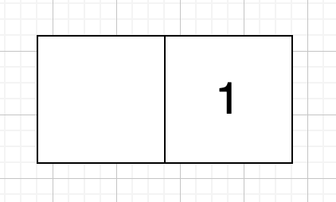
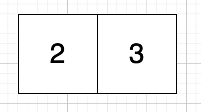
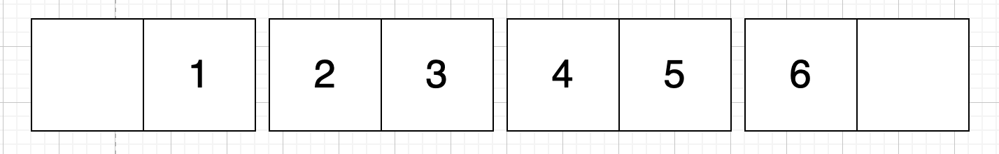
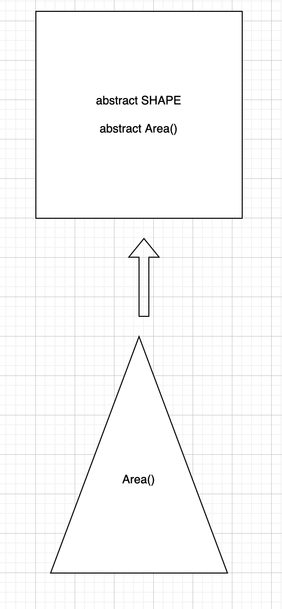
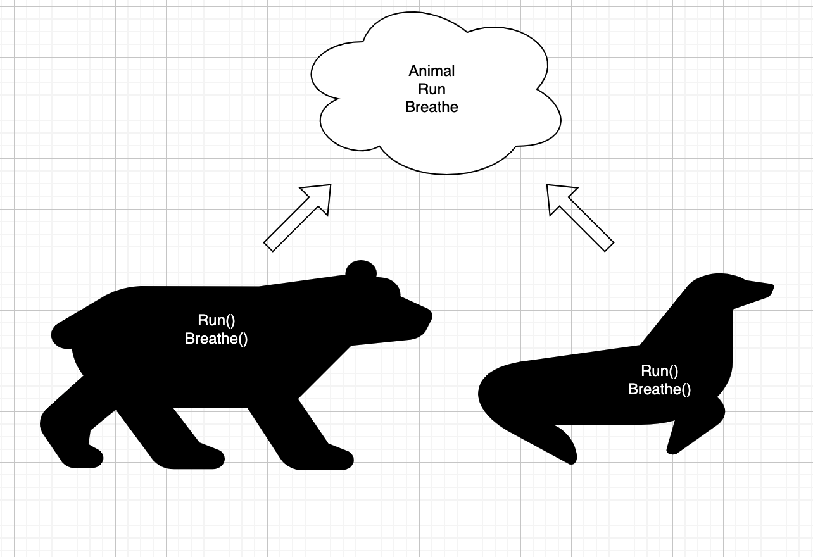
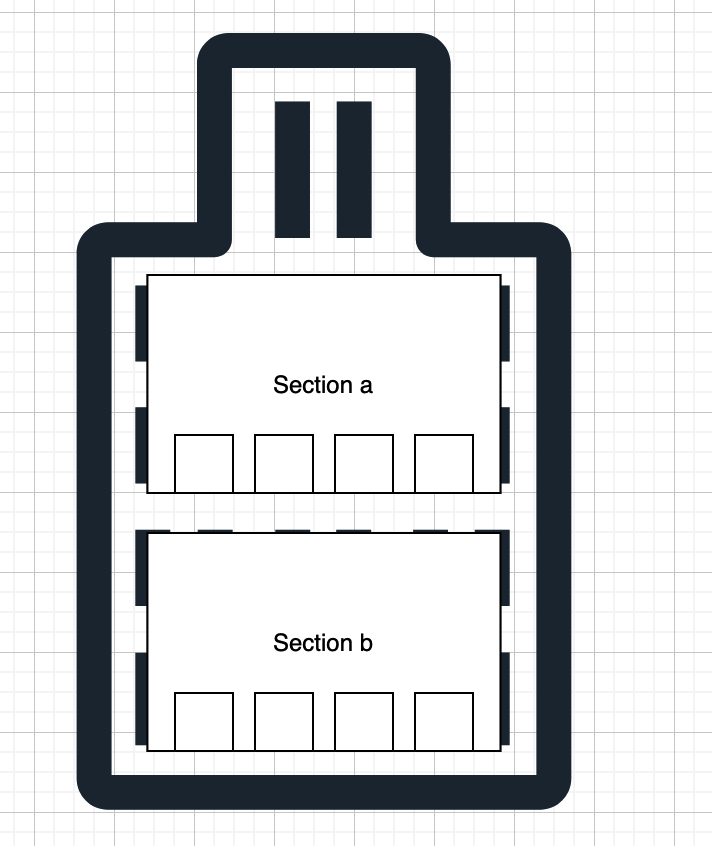

# DOU by Tech Mahindra

## AHC Training Week 10

#### OOP 

<br/>
<br/>
<br/>
<br/>

This week we will accomplish

- Understand what is oop and why so many languages rely on it

### WEEK ALGORITHM
A teacher asks the class to open their books to a page number. A student can either start turning pages from the front of the book or from the back of the book. They always turn pages one at a time. When they open the book, page  is always on the right side:



When flip they see pages 2 and 3



Not all the pages contain 2 numbers, for example page 1 contains empty, 1 and last page depending on the book length may contain, the page number and empty as the following vector.



Using the diagram above, if the student wants to get to page 3, they open the book to page 1, flip  page and they are on the correct page. If they open the book to the last page, page 6, they turn 2 page and are at the correct page. Return 1 which is the minimum.

Write a function that receives the length of the book and also what page to locate into, if 3 as the example above you just need to turn the pages 1 time, if for example you want to go to page 8 of a book ot 10 pages you need to 

from the beggining // null, 1
flip 1 time //pages 2 and 3
flip 1 time // now pages 4, 5
flip 1 time // now pages 6 , 7
flip 1 time // now pages 8 , 9

Meaning you need to turn pages 4 times.
but consider if you start from the end

from the end // 10, null
flip 1 time // now pages 8 , 9

Meaning you need to turn pages just one time which is ideal


however 

INPUT
* 5 // Length of book
* 4 // Page to be in

OUTPUT
return 0;

INPUT
* 10 // Length of book
* 4 // Page to be in

OUTPUT
return 2;

### OOP

#### Questions
<hr/>

* What is an instance?
Is create a object throught a class
* What are the four pillars of OOP?
1) abstraction
2) encapsulation
3) polymorphism
4) inheritance
* What is the difference between instance and class?
A class is like a template to create objects
* What does it mean a class will derive from another?
Means that the properties are inherited
* How would you follow encapsulation principle in C#?
The encapsulation in C# is impremented with Access Modifiers like public, private, internal and protected
* Put an example of polymorphism?
usar el mismo metodo en diferentes clases
* If i have a the following...
```
class Animal {
  public int Weight { get; set; }
  public int Height { get; set; }

  public Animal (int weight, int height) {
    this.Weight = weight;
    this.Height = height;
  }
}

class Horse : Animal {
  public string race { get; set; }
  public Horse (string race) : base(800, 234) {
    this.Weight = race;
  }
}
```

* What are the properties you can interact with an instance of Horse?
Weight and Height

* Explain encapsulation in your own words.
Is like the scope that the classes have it and it can be defined by access modifiers

* Difference between abstract class and interface?
Abtract class: shares funcionality and creates override methods
Interface: defines a signature 
* How do you define an abstract class?
public abstract class Name {

}
* Can you define abstract methods, how?

* How do you instantiate an abstract class?
The abstract class can't be instantiated

* How do you implement the methods?

* How do you define a pure abstract class?
Is when the class and the methods in this class are abstract 
* Difference between overload and override?
overload: no se utiliza como palabra reservada, sobrecargar, la firma del metodo
override: necesita utilizar la palabra reservada
* What does sealed mean?

* Explain with your own words what inheritance is?
Is when you pass fields and methods from a class to another one  
* What is a signature?


#### Exercises
* Create a console app
* Create an abstract class called `Shape`
* Create abstract method called `Area`
* Create a class called `Triangle` and calculate the area of the triangle overriding the area method
deriving from abstract class `Shape`
* Create an instance of `Triangle` and print out the result of `Area` with `Console.WriteLine`

 ✅


* Implement inheritance creating a project where animal is the base class and different animals has to override run and breathe methods 

 ✅


* Implement encapsulation creating a console application where you're living in a building with 2 sections
Section a: Properties and methos can be seen by any apartment in any secion
Section b: Properties and methods can only be seen by appartments on the same section.

 ✅


#### References
https://www.youtube.com/watch?v=pTB0EiLXUC8
https://www.educative.io/blog/object-oriented-programming
https://medium.com/@cancerian0684/what-are-four-basic-principles-of-object-oriented-programming-645af8b43727