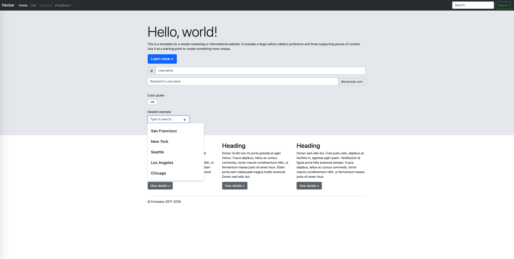

# DOU by Tech Mahindra

## AHC Training Week 2

#### CSS BASICS
#### Pseudo Elements And Pseudo Classes
#### CSS Layouts
#### Responsive design
#### Css frameworks
#### Form Validations

<br/>
<br/>
<br/>
<br/>

### WEEK ALGORITHM
Run-length encoding is a fast and simple method of encoding strings. The basic idea is to represent repeated successive characters as a single count and character. For example, the string "AAAABBBCCDAA" would be encoded as "4A3B2C1D2A".

Implement run-length encoding and decoding. You can assume the string to be encoded have no digits and consists solely of alphabetic characters. You can assume the string to be decoded is valid.

### WEEK EXCERCISE
At the end of the week you must have the following
✅
✅


### CSS BASIC

#### Questions
* Float position vs display how they work?
Float: is used to allow to an element float in a container
Display: specifies how an element is displayed and controls the layout 

* What are selectors what is the selector for tag, class and id?

The selectors are used in order to add style to HTML elements 

Tag: selects a HTML element

Class: selects an element with a class attribute 

Id: selects an unique element

* You have the following code... How would you select the following button and what is the code to make it red, with white text, bordered and also with rounded corners?

```
	<div>
		<button class="my-btn" >Hit me!</button>
	<div> 
```

.my-btn {
	background-color: red;
	color: white;
	border: 1px solid black;
	border-radius: 5px;
}

* What are margins and paddings?

The margin is outside of the element and the padding is the space inside of the element

* What does it mean that styles are in cascade?

Means that more than one stylesheet can be added for each HTML document

####  References
https://codecoda.com/en/blog/entry/css-selectors-properties-and-values ✅
https://www.w3schools.com/css/css_float.asp ✅
https://www.youtube.com/watch?v=1PnVor36_40 ✅

### Pseudo Elements And Pseudo Classes

#### Questions
* What are pseudoelements and what is the syntax they use?

Acts like pseudo classes but, like it have been added a new element, for example:

article p :: first-line {
	font-size: 120%;
	font-weight: bold;
}

* What are pseudo classes mention 2 and how to write them?

Are based in the state that is the response of the user actions

1) Pseudo classes: 

article p: first-child {
	font-size: 120%;
	font-weight: bold;
}

2) Dynamic pseudo classes:

a:hover {
	color: blue;
}

* What is the hover state of an html element and how can you use it for design with css?
Is used for select elements when the user mouse over them, for example: in a link

#### References 
https://developer.mozilla.org/es/docs/Learn/CSS/Building_blocks/Selectors/Pseudo-classes_and_pseudo-elements ✅

### CSS Layouts

#### Questions
* What is flex?
Is a tool used to layout space distribution in the web page with rows and columns 

* What are the properties flex grow and flex shrink?

Flex - grow: the item can grow and takes the available space

Flex - shrink: the item can shrink and takes the available space

#### Excersises
Try to emulate both models in 2 separated files.

 ✅
 ✅

#### References 
https://css-tricks.com/snippets/css/a-guide-to-flexbox/ ✅
https://developer.mozilla.org/es/docs/Web/CSS/CSS_Flexible_Box_Layout/Basic_Concepts_of_Flexbox ✅

### Responsive design

#### Questions
* What is responsive design?
Is to make a web page adapt to each device

* What are media queries?
Is used in order to include a properties block just in case if an condition is true

* How does bootstrap manages the media queries or breakpoints?
Including six default breakpoints

#### Exercises
Write an html page which has the following layouts 

Phone
 ✅

Tablet
 ✅

Web 
 ✅

#### References 
https://getbootstrap.com/docs/5.0/layout/breakpoints/ ✅
https://www.w3schools.com/css/css_rwd_mediaqueries.asp ✅


#### Css frameworks

#### Questions
* What are css frameworks and why they are useful?
Are tools and libraries that could be reused for several projects 

* Mention 4 css frameworks.
1) Node Js
2) Bootsrap
3) Redux
4) React

#### Exercises
With bootstrap do this 


#### References
https://getbootstrap.com/docs/5.0/ ✅
https://mui.com/ ✅

#### Form Validations

#### Questions
* What kind of types input admits?
a) text
b) radio
c) checkbox
d) submit
e) button

* What are html validations?
Is the process to validate that the input elements from the user are complete and correct before to send them to the server

* What is required attribute for?
Doesn't allow that the input field be empty

* What is pattern attribute for?
Is the reference that the input elements have to follow in order to be valid

#### Exercises
With html forms do this
 ✅ 

Then add required validation upon lastname and firstname

Finally add pseudo selector invalid to paint the background of an invalid element in red

If you want to go further you can use pseudo elements to paint a mark after the input indicating something is wrong(maybe an emoji or something https://www.w3schools.com/html/html_emojis.asp )

#### References
https://www.w3schools.com/html/html_forms.asp ✅
https://www.w3schools.com/js/js_validation.asp ✅
https://developer.mozilla.org/es/docs/Learn/Forms/Form_validation ✅