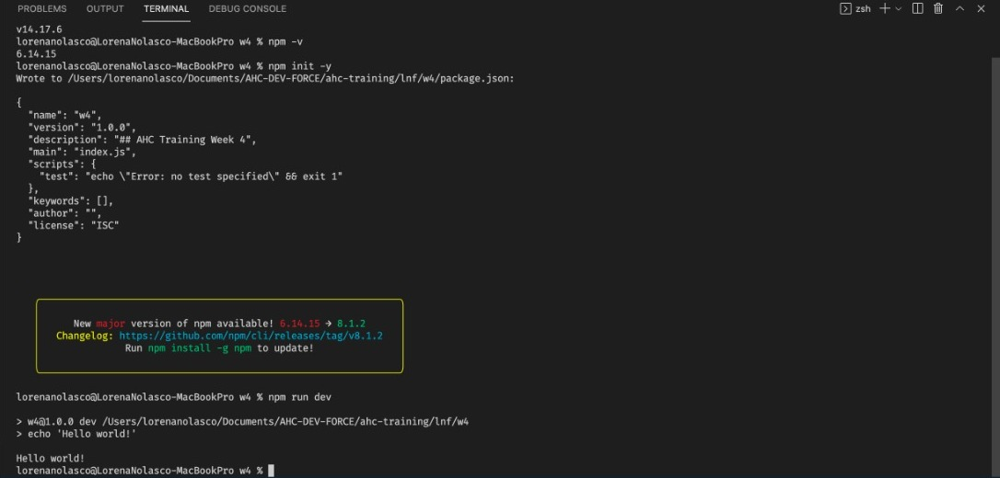
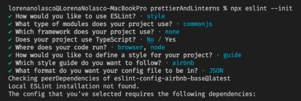

# DOU by Tech Mahindra

## AHC Training Week 4

#### Package Managers npm vs yarn
#### Advanced js (hoisting, event bubbling etc.)
#### Web security (HTTPS, CORS)
#### GIT
#### Module bundlers
#### eslint and prettier

<br/>
<br/>
<br/>
<br/>

This week we will accomplish
- What is version control and how to work with it, know about commits, fetch pull request etc.
-Know a little bit more about js world
-Know more about modern web with bundlers and stylers

### WEEK ALGORITHM

Given a time in -hour AM/PM format, convert it to military time.

Note:
- 12:00:00AM on a 12-hour clock is 0000 on a military clock.
- 12:00:00PM on a 12-hour clock is 1200 hours on military time,
- 6:00:00AM on 12-hour clock will be 0600 on military time

input 

`12:00:00AM`

output

`0000`

<hr />
input 

`12:00:00PM`

output

`1200`

<hr />
input 

`4:00:00PM`

output

`1600`


### WEEK EXCERCISE
Lift up a react project with webpack, configure eslint, using yarn,

### Requirements
* use yarn
* have very dumb application may with hello world in an h1 and that is it
* be able to run the app bundled by rollup or webpack
* add raw styles from eslint

<strong><i>For reference follow:</i></strong>

https://swapps.com/es/blog/configurar-webpack-en-un-proyecto-reactjs/

### PACKAGE MANAGERS

#### Questions
* what is a package manager for?
Is a program that help us to install, update, and remove libraries inside of the project 
* npm vs yarn differences?
1) more security
2) more speed
3) license checker
* why yarn born in the first place?
Yarn was born like a package manager improvement and it was developed by Facebook 
* what are dev dependencies?
Are the references that the libraries have by default and are installed automatically
* what are peer dependencies?
Are the references that are not included in the libraries and have to be installed manually
* scripts? what are they for?
are commands in a file to create simple programs
s
####  Exercises
write a simple project in node that uses scripts, like echoing a hellow world to the console, so you need to set an scripts key in `package.json`, put an alias and then run it

alias should looks like 

```
	"scripts": {
		"dev": "echo 'Hello world!'",
	}
```

`yarn dev` or `npm run dev`

✅

<strong>
	<i>Remeber</i>
</strong>
if you havent install yarn globally you are not going to see it for that you need to install nodejs in mac from homebrew in windows from chocolately or directly from the node page, remember to use always the stable version, with that you will have access to the command npm in terminal, go and try it out
open command prompt or terminal and put  

`yarn dev`
this will give you the npm version and you are good to go, now we need yarn
`npm i -g yarn`
you are all set, that installed yarn globally

####  References

https://www.google.com/search?q=why+yarn+over+npm&oq=why+yarn&aqs=chrome.1.69i57j0i512j0i22i30l8.2886j0j7&sourceid=chrome&ie=UTF-8 ✅
https://hashnode.com/post/master-npm-in-under-10-minutes-or-get-your-money-back-cjqmak392001i7vs2ufdlvcqb ✅
https://www.youtube.com/watch?v=FS31-9zbcLA ✅

<hr/>

### Advanced JS
#### Questions
* What hoisting is?
When declarations are move to the beginning of their scope
* what happens when...

```
awesome();
function awesome() {
}
```
--> The function will be initialized

```
awesome();
const awesome = () => {
}
```

--> It can't access the function before to be declared

* What are the event phases(bubbling, capturing) and how they are different?
bubbling: Is when an event runs from inside to outside and is by default
capturing: Is when an event runs from outside to insides

* What is the prototype in js and why is useful?
Is an object used to inherit methods and properties from the objects

* Why this is possible `4 + '4'` 
Because occurs a implicit conversion of types between value 4 and string 4 

* why is the difference between `4 == '4'` && `4 === '4'`?
The first one just is comparing value and the second one is comparing value and type

* What is type coercion?
Is an implicit conversion to other type

#### Exercises
* Check the output of 
`4 == '4'` and
`4 === '4'`
analize their differences ✅

* Check the output of
```
awesome();
function awesome() {
}
```
```
awesome();
const awesome = () => {
}
```
analize their differences ✅

* Check if both are valid and why
```

function awesome() {
	var t = 4;
}
awesome();
console.log(t);

```
```

function awesome() {
	let t = 4;
}
awesome();
console.log(t);

```
analize their differences ✅

#### References 
https://developer.mozilla.org/es/docs/Glossary/Type_coercion ✅
https://developer.mozilla.org/es/docs/Glossary/Hoisting ✅
https://developer.mozilla.org/es/docs/Glossary/Scope ✅

### CORS and HTTPS
#### Questions
* Explain with you own words what is HTTPS and how it works.
Is hypertext transfer protocol that have a security certificate in order to encrypt confidential information of the user when it is transported
* Which is the protocol that HTTPS uses to encrypt the data?
Transport Layer Security 

* What is CORS?
Is a security policy of cross-origin resource sharing that allows to a web page from one domain or Origin to access a resource with a different domain

### GIT
#### Questions

* What is version control for?
Is a tool for code version control

* What is a merge conflict and how do you solve it?
Is when the same code line was modified by different people

* What tools are out there to help you with git?


* what are the remotes in git?
Is a command that allows create and delete connections between repositories

* What are tags for?
Is like a label for identify a code version

* What is the stage?
Is when there are changes in the local repository that have not been committed already

* What is the stash?
Is a command that store the changes temporarily

* How do you add changes to your stage?
git add

* How do you pass stage changes to your remote?
git push

#### References 
https://rogerdudler.github.io/git-guide/ ✅

### Module bundlers
#### Questions

* What are a bundlers for?
Is a tool that compiles several JavaScript files to make it one in order to do faster websites
* Get cons and pros over rollup and webpack?
Webpack: import static resources and is used for medium and big projects 
Rollup: delete unuseful code and is used for small projects  
* What is babel and why is popular nowadays?
Is a JavaScript compiler and is popular because allows transform ECMAScript 2015+ syntax for different versions of browsers

#### Exercises
* Create an small folder install babel and then use it in the scripts to parse es6 into es5 ✅

#### References 
https://blog.openreplay.com/the-ultimate-guide-to-getting-started-with-the-rollup-js-javascript-bundler ✅
https://medium.com/@aganglada/webpack-is-easy-44fef4619a06 ✅
https://babeljs.io/docs/en/ ✅

### Prettier and linterns
#### Questions

* What are formaters for?
Are used in order to improve the style and the quality of the code
* What are linterns for?
Is a tool that is used to remove errors from our code 
* Mention at least 3 rules of eslint?
1) array-callback-return: 	enforce "return" statements in callbacks of array methods
2) camelcase: enforce camelcase naming convention
3) quotes: enforce the consistent use of either backticks, double, or single quotes

#### Exercises
* Create an small project folder and install eslint and put some rules for your programming IDE to recognize it, you also need to install such plugin, for vscode in extensions window you need to install eslint, same in sublimetext ✅



#### References 
https://eslint.org/docs/user-guide/getting-started ✅
https://survivejs.com/maintenance/documentation/linting/ ✅