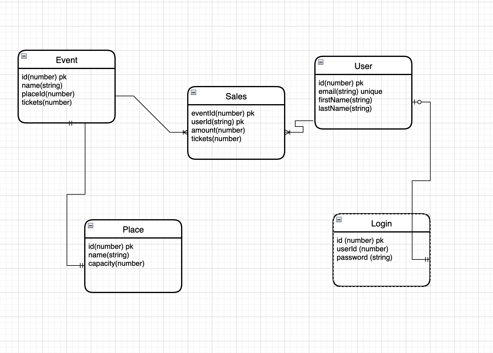

# DOU by Tech Mahindra

## AHC Training Week 12

#### SQL FUNDAMENTALS

 
 
 
 

This week we will accomplish

- SQL vs No SQL
- Understanding more about design databases
- Normalization and denormalization
- DB indexes
- SQL vs No SQL
- Understanding more about design databases
- Normalization and denormalization
- SQL queries
- Constraints
- Understanding store procedures and triggers

### WEEK ALGORITHM
N/A

### "SQL FUNDAMENTALS"

#### SQL NO SQL
#### Questions

* What is sql?

* What is no sql?

* What is transact sql?

* What is dml, dcl and ddl?

#### CARDINALITY/MULTIPLICITY
#### Questions

* What kind of relations exists?

* In DB how do you express a relationship many to many?

* In DB how do you express a relationship one to one?

* In ddl how do you create a table?

* In ddl how do you remove a table?

* In ddl how do you preserve a table but empty?

#### Exercise
We need to create the following table

#### INDEXES
#### Questions
* What an index is?
* Clustered index vs non cluster indexes 

#### NORMALIZATION
#### Questions
* Describe 3 normal forms
* What is denormalization?
* Write cons and pros

