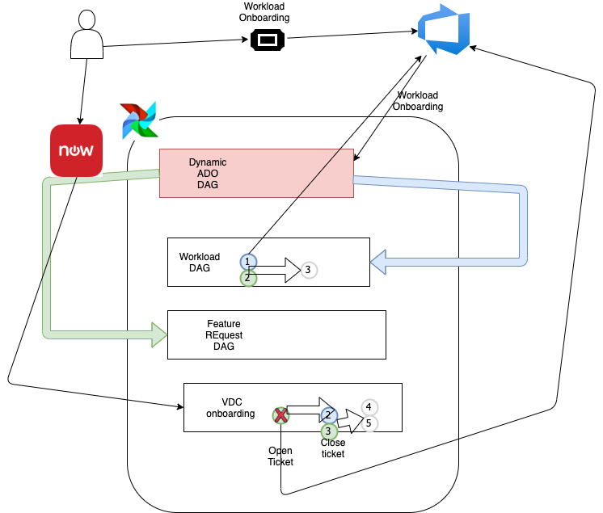

# Dynamic & Static DAGs 



---

# LOCAL DEVELOPMENT 

## DYNAMIC DAG: 

## Workloads Adoption

**TODO:** With Airflow is running locally on your machine in a docker container, assuming you are in Assurant's VDI, then you should have access to ADO and Airflow's ADO token configured so Airflow can communicate with ADO. In order to start this DAG, turn it on from the UI and then create a new ADO work item *Epic* type with a tag called **workloads_adoption**. Using one of these tags will automatically trigger a dyanamic DAG created with its own specific set of tasks for the workflow.

*Workloads Adoption* was the first iteration and has been completed, but there is still lots of work to do for making each step following the human process Assurant currently has in place. There will need to be more meetings to clarify each step with Vasant, Alex and Nagesh in order to get it perfect. In this first iteration the way this dynamic dag works is a *Dynamic DAG Creator* is querying ADO for work items for one of the triggering tags (**workloads_adoption** or **new_feature**), then based on the amount of work items containing the trigger tags, new DAGs are dynamically created in Airflow UI with its own set of tasks associated with it.  

In this iteration each new DAG's set of tasks creates a new ADO work item, a Teams notification is sent and the next task in the process will not proceed until a team member has updated the state of this work item to *closed*. When that happens the DAG goes to the next task in the process. **Be advised for this process when a Workloads Adoption Process Teams Meeting Request work item is created there needs to be more development on handling if the request is denied,** which should close the parent Epic work item and then send a Teams notification to the requestor and owner indicating that the request was denied. For demo purposes this DAG only works when request is approved and proceeds to the next tasks until all Workloads tasks are complete then the parent Epic is finally closed. 

## New Feature

*New Feature* has not been developed much yet and only placeholder tasks have been put there for demonstration purposes similar to *Workloads Adoption*. In order to start this DAG, turn it on from the UI and then create a new ADO work item *Epic* type with a tag called **new_feature**. Using this tag will automatically trigger a dyanamic DAG with its own specific set of tasks for the workflow.

---


## STATIC DAG: 

## VDC Onboarding

### Mock Payload and Manually Trigger VDC Onboarding DAG, which will simulate a payload coming from ServiceNow.

Start Airflow locally by running Docker

```
docker-compose up
```

Get container ID for Airflow webserver, copy container ID and SSH into the container
```
docker exec -it $(docker ps | grep airflow:v1 | awk '{print $1}') sh
```

Simulate a payload coming from ServiceNow by manually triggering the Airflow VDC-Onboarding-DAG
```
airflow trigger_dag "VDC-Onboarding-DAG" --conf '{"name": "Selman", "application_name": "local_test_airflow", "service_principal" : "Service Principal","subscription_name" : "Subscription Name","environment" : "Development", "sdlc_envrionments" : ["dev", "model", "prod"], "tfe_workspace_prefix" : "TFE Workspace Prefix", "tfe_token_variable_group_name" : "TFE Token Variable Group", "ado_repo_name" : "ADP-Repo-Name", "ado_project" : "ADO-Project-Name", "solution_architect": "Selman Petek", "application_architect": "Leonard Joseph Castaneda", "technical_leader": "Sam Flint", "environment": "dev", "team_members": "Nagesh Potluri", "owners": ["Nagesh Potluri"]}'
```

## [View the DAG from Airflow UI](http://localhost:8080/)

---
 
# TODO: VDC Onboarding

**DEV environment:** Testing will need to be done by making Postman API calls to trigger the VDC-Onboarding-DAG exactly like we are doing when testing locally. The work item in ADO to track this work is here: 
**[TASK-326216: Create PostMan API Call to Trigger Airflow DEV API](https://dev.azure.com/AIZ-GT/GT.ICS-Cloud%20Planning/_workitems/edit/318337)**

---

**MODEL environment:** Use ServiceNow API calls to trigger the VDC-Onboarding-DAG exactly, which is the *Production-ready* use-case. The work item in ADO to track this work is here: 
**[TASK-324487: Create ServiceNow Enhancement Request to Trigger Airflow MODEL API](https://dev.azure.com/AIZ-GT/GT.ICS-Cloud%20Planning/_workitems/edit/324487)**