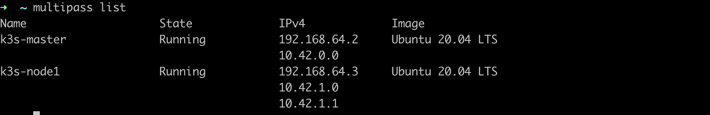
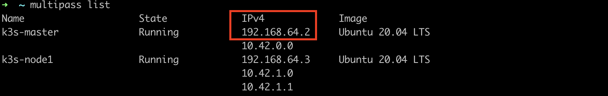
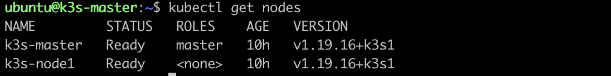
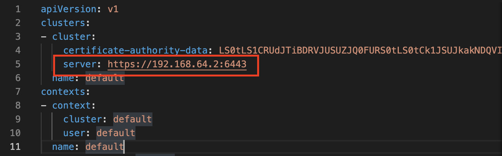
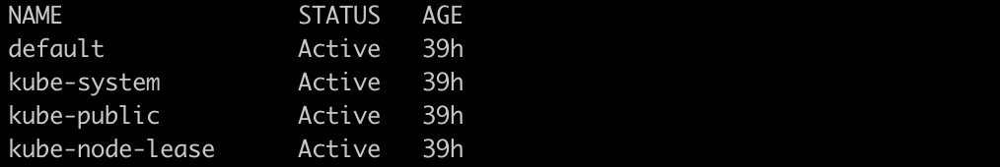
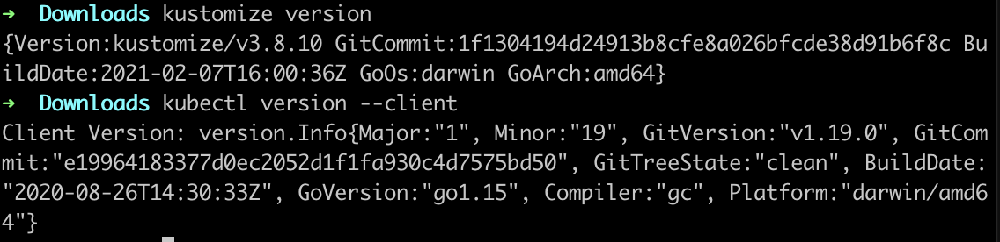
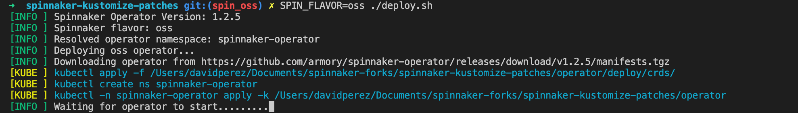
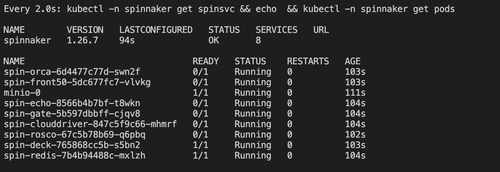

# Operator and Spinnaker OSS Installation

## Prerequisites

To install the Operator OSS you need a tool called [multipass](https://multipass.run/) and the [kustomize-patches](https://github.com/armory/spinnaker-kustomize-patches) repository.

Multipass is a lightweight VM manager for Linux, Windows and macOS. It's designed for developers who want a fresh Ubuntu environment with a single command.

```bash
brew install --cask multipass
git clone https://github.com/armory/spinnaker-kustomize-patches.git
```

Just to check that multipass is installed:
```bash
multipass version
```

Output:
``` ssh
multipass   1.8.1+mac
multipassd  1.8.1+mac
```

After installing multipass run the following commands to create and run the virtual machines you will need:

```bash
multipass launch --name k3s-master --cpus 1 --mem 1024M --disk 3G
multipass launch --name k3s-node1 --cpus 4 --mem 16384M --disk 70G
multipass list
```
Output:



# Installing k3s inside the instances

k3s-master as a k3s unit and k3s-node1 as an agent.

Follow the next steps:

## k3s-master unit

```bash
multipass exec k3s-master -- /bin/bash -c "curl -sfL https://get.k3s.io | K3S_KUBECONFIG_MODE=644 INSTALL_K3S_VERSION="v1.19.16+k3s1" sh -"

# enter the k3s-master and get the server token
multipass shell k3s-master
sudo cat /var/lib/rancher/k3s/server/node-token
```

Copy the token you get as output example:
```
K10167a79dca5b6e7b49cc6885da1cef0f21f6fc9507574ce1ba9acdfa3be1fa7e0::server:20bb9739745f78abd0ef986203499c7
```
```bash
# exit the k3s-master shell
exit
```

## k3s-node1 agent

Export the following viriables to use it in the next command:

```bash
# the token you copied
export K3S_TOKEN=K10167a79dca5b6e7b49cc6885da1cef0f21f6fc9507574ce1ba9acdfa3be1fa7e0::server:20bb9739745f78abd0ef986203499c7
```

Then export the ip of your k3s-master instance.

```bash
export K3S_NODEIP_MASTER=https://192.168.64.2:6443
```

If you don't know you ip can check it using the following command:




Run to install k3s in node1 instance.

```bash
multipass exec k3s-node1 -- /bin/bash -c "curl -sfL https://get.k3s.io | INSTALL_K3S_VERSION="v1.19.16+k3s1" K3S_TOKEN=${K3S_TOKEN} K3S_URL=${K3S_NODEIP_MASTER} sh - "
```

Now enter the shell of your k3s-master instance and run the following command to check the comunication of the two instances through kubernetes.

```bash
multipass shell k3s-master

#inside k3s-master
kubectl get nodes
```

Output:



## seting up kubeconfig

Inside k3s-master run:

```bash
cat /etc/rancher/k3s/k3s.yaml
```
Copy the output and exit the k3s-master shell.

Then open your kubernetes config: ~/.kube/config erase everything and paste the output.

Edit the 5fth line server propety in your config file to your <k3s-master instance>



To check that you can talk to your kubernetes server run:

```bash
kubectl get ns
```

Output:



# Installing Spinnaker and Operator OSS

To avoid the following known error [kustomize panic error](https://docs.armory.io/armory-enterprise/installation/armory-operator/op-troubleshooting/#kustomize-panic-error).

You need to downgrade the kustomize and kubectl version.

- Downgrade Kustomize to v3.8.10.
- Downgrade to kubectl v1.19.16

First remove your previus version of Kustomize to avoid any issues:

```bash
#If you install them with brew you can use the following commands to remove them
brew uninstall kustomize
brew uninstall kubectl
```

Then Download this script file [script](https://github.com/kubernetes-sigs/kustomize/blob/master/hack/install_kustomize.sh).

If the previous link is broken you can use the one in this repo, but check the one on top first to use the newest version [script](./scripts/install_kustomize.sh).

```bash
# give execution permissions
chmod +x ./install_kustomize.sh
./install_kustomize.sh 3.8.10

# move the binary
mv kustomize /usr/local/bin

# kubectl v1.19
curl -LO https://storage.googleapis.com/kubernetes-release/release/v1.19.0/bin/darwin/amd64/kubectl

# give execution permissions
chmod +x ./kubectl

# move the binary
sudo mv ./kubectl /usr/local/bin/kubectl

#check the versions
kustomize version
kubectl version --client
```

Output:



Change directory to where you clone the kustomize_patches and edit the kustomization.yml file for the resources you want.

For best practice simply create a symlink:

```bash
ln -sf ./recipes/kustomization-minimum.yml kustomization.yml
```
Edit the spinnakerservice.yml to use the spinnaker oss:

- apiVersion: spinnaker.armory.io/v1alpha2 -> spinnaker.io/v1alpha2
- version: 1.26.7

Change the apiVersion from spinnaker.armory.io/v1alpha2 to spinnaker.io/v1alpha2 in all the files that kustomization.yml refers to

Last steps:

Install watch for the deploy script:

```bash
brew install watch
```

Run the deploy script with spinnaker oss flavor:

```bash
SPIN_FLAVOR=oss ./deploy.sh
```

Wait for the spinnaker operator and spinnaker namespaces to be created.

Output:



After it finishes you should se the following command and the pods starting up.
```bash
kubectl -n spinnaker get spinsvc && echo && kubectl -n spinnaker get pods
```


Source for this readme:

https://www.youtube.com/watch?v=oBhUyFbzCjc&ab_channel=JBDom

https://www.youtube.com/watch?v=q6TMTj52PJQ&t=1s&ab_channel=JBDom
