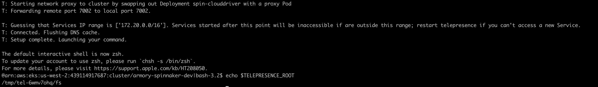
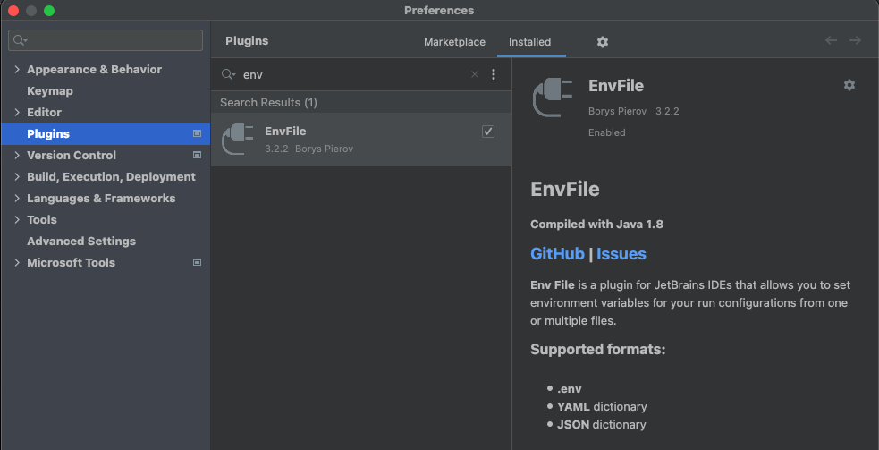
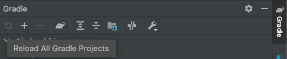
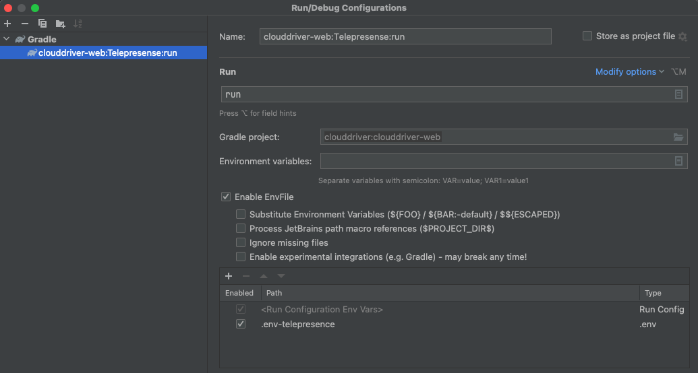

# Telepresence Installation

Telepresence is a tool to debug your Kubernetes service locally.

## Prerequisites

To use Telepresence you need macfuse and SSHFS.

MacFUSE allows you to extend macOS's native file handling capabilities via third-party file systems, basically it creates a file system in a user-space.

SSHFS is a filesystem client to mount and interact with directories and files located on a remote server or workstation over a normal ssh connection.

```console
brew install --cask macfuse
brew install gromgit/fuse/sshfs-mac
brew link --overwrite sshfs-mac
sshfs -V
```

Output:
```ssh
SSHFS version 2.10
FUSE library version: 2.9.9
fuse: no mount point
```

## Telepresence

We are installing telepresence Version 1.

The only limitation of the version 1 is that it only lets you run a single service locally, while connecting that service to a remote Kubernetes cluster.

```console
brew install datawire/blackbird/telepresence-legacy
```

Check telepresence version.
```console
telepresence --version
```

Output:
``` ssh
0.109
```

## Using Telepresence

Once install you need to do 2 things:

* Run Telepresence   (Every time).
* Configure your IDE (Just Once).


### Run Telepresence

First you need to download the repo of the service you wish to swap deployment and cd inside of it.

To see what deployments you can swap with Telepresence run the following command(in the following steps we are going to use clouddriver as an example).
```console
kubectl get deploy -n <your-name>-spin --kubeconfig ~/.kube/tm.yaml
```

Once inside the project you need to run the following command (it will ask for your password).

```console
KUBECONFIG=~/.kube/tm.yaml telepresence --namespace <your-name>-spin --swap-deployment spin-clouddriver --env-file .env-telepresence
```

The previous command does 2 things:

* First it mirrors all of the environment variables that are define inside of the pod into the file .env-telepresence.
* Secondly when the command finishes you should see the bash terminal of your cluster.

When you are in the new bash terminal you are able to see the environment variables, the one we need to echo is $TELEPRESENCE_ROOT, this is where the volumes are located on your local machine.

```console
echo $TELEPRESENCE_ROOT
```

Output:
``` ssh
/tmp/tel-6wmv7ohq/fs
```



Don't close this terminal window, if you wish to stop Telepresence simply type exit and click enter.

The last step to be able to intercept the traffic is to move some of the content of the virtual filesystem to ~/.spinnaker.

Using a different terminal run the following command:

```console
cp $TELEPRESENCE_ROOT + /opt/spinnaker/config/* ~/.spinnaker
EXAMPLE cp /tmp/tel-6wmv7ohq/fs/opt/spinnaker/config/* ~/.spinnaker
```

Note: If you don't have the ~/.spinnaker directory you need to create it.

```console
mkdir ~/.spinnaker
```

Now if you already had IntelliJ or any other IDE configured you can just run the code and you are good to go.

Happy Coding!!!

Notes:

* To stop telepresence you simple need to type exit on the terminal where you did the swap-deployment and click enter.

* If this is your first time following this tutorial or you haven't configure any IDE please check below for instructions.

## Configure IntelliJ

In this section we are going to configure IntelliJ IDEA community edition, if you are using the Ultimate version the steps should be the same.

The first thing you need to do is to install the EnvFile plugin, in mac you can click Command + , to open the Preferences or click on IntelliJ IDEA->Preferences, then go Plugins and search for EnvFile and install it.



After the installation you may need to restart the IDE, do it and reopen the project.

Once the project has finish loading be sure that also the gradle changes had been loaded (check the right side of your IDE).



Then create/edit a new configuration, click on the plus and select gradle, where it says Gradle Project: select the web one, in our case is clouddriver:clouddriver-web, then Enable EnvFile, click on the + and select the .env-telepresence, Apply, Ok, and you are now ready to run the project.



### Troubleshooting

When setting up the EnvFile you may not see the file .env-telepresence, you can select any other file inside the project and rename it to .env-telepresence, if the IDE shows the file as red there is an issue if it's not everything's alright.

## Documentation and Resources
https://www.telepresence.io/docs/v1/discussion/overview/

https://github.com/telepresenceio/telepresence

https://osxfuse.github.io/
