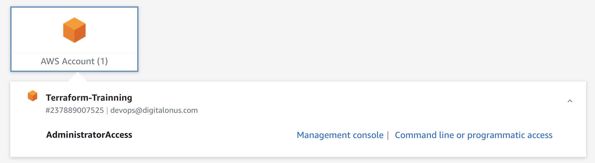

# CAAS Project AWS Development 

### Description
The purpose is to create an infrastructure using Terraform/Terraform Cloud and AWS as Cloud Provider, it builds an ERC, network, and runs services like Consul, Vault, etc.
Terraform project split into files by the action they complete on AWS.

### Prerequisites:
1. Is your Macbook set up yet?  If not, [go here](https://gitlab.com/DigitalOnUs/m-mir/tools) and follow the instructions in the README.
2. You will need to make sure you are authenticated into an AWS account - https://digitalonus.awsapps.com/start#/
    * If you don't have a DOU AWS account yet,  
        A. Submit a ticket at https://digitalonus.atlassian.net/servicedesk/customer/portals and ask for a DOU-TFE AWS account.  
        B. Under your onboarding JIRA Epic, create a [JIRA like this](https://digitalonus.atlassian.net/browse/DEVON-98) and   link your Service desk ticket in it.  Assign the JIRA to Jesus Gomez or Daniela Becerra.  
3. Ensure that you are on terraform version 0.13.0 or *older*: `terraform --version`
4. Retrieve and configure the AWS credentials by clicking on the `Command line or programmatic access` link at https://digitalonus.awsapps.com/start#/ , following the instructions there(DON'T FORGET YOUR SESSION TOKEN!):

 
5. If an`aws s3 ls` returns some s3 buckets, you're good to proceed.

### Installation

1. If you're doing development on this module, set `cass.auto.tfvars`'s `project_name` to your JIRA task in lowercase and with no dashes, like this:
```
project_name = "fewknow97"

IMPORTANT:  When testing is finished, change `project_name` to `Development`  
before opening a PR so that we will run on the CaaS-Development workspace.
```
2. This will redirect you to the Terraform Cloud page, and you create a new token that you will paste in the terminal
 ```sh
terraform login
```

3. This will install Terraform modules required for this project.
```sh
terraform init
```

4. Review the build before it is built.
```sh
terraform plan
```
5. Build the project.
```sh
terraform apply
```
6. Next, you'll need to go to https://gitlab.com/DigitalOnUs/singularity/caas/local-dev-services and follow the instructions.

### Cleanup

CU. Tear down your infrastructure at the end of every day.
```sh
terraform destroy
```

## Maintainers

- Sam Flint sam.flint@digitalonus.com

## Contributors

- Sangeetha Gajam sangeetha.gajam@digitalonus.com
