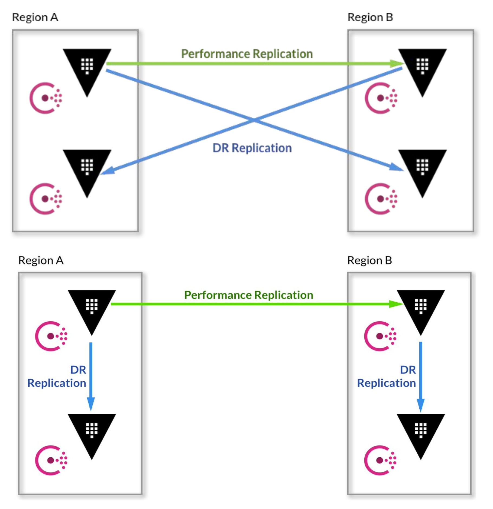

# Vault Disaster Recovery 

### **Vault Replication -  Multiple Regions**

Vault Replication

Vault can be extended to multiple regions using replication. The primary cluster uses asynchronous replication to ship data to the secondaries. Multiple replication modes can be combined to provide resilience and performance.
- Disaster Recovery Replication provides a standby cluster that contains all data from the primary Vault cluster. It is strongly recommended to deploy at least one DR cluster.

- Performance Replication provides an active Vault cluster with shared state of the primary. This includes secrets, authentication methods, policies, and other shared data. Token and leases are not replicated to performance secondaries.

Determining Replication Mode
In our most successful deployments, DR and performance replication are used in conjunction to meet resilience and performance requirements. When determining which replication mode to use you should considering the following:
- Disaster Recovery
  - RPO/RTO requirements
  - Tier 0 or 1 apps be accessing secrets from Vault
- Performance Replication
  - Source of Requests
  - Performance requirements for request and
response
  - Types of workloads

**Performance Replication and Disaster Recovery (DR) Replication explanation**

`Performance Replication`: In performance replication, secondaries keep track of their own tokens and leases but share the underlying configuration, policies, and supporting secrets (K/V values, encryption keys for transit, etc).

If a user action would modify underlying shared state, the secondary forwards the request to the primary to be handled; this is transparent to the client. In practice, most high-volume workloads (reads in the kv backend, encryption/decryption operations in transit, etc.) can be satisfied by the local secondary, allowing Vault to scale relatively horizontally with the number of secondaries rather than vertically as in the past.

`Disaster Recovery (DR) Replication`: In disaster recovery (or DR) replication, secondaries share the same underlying configuration, policy, and supporting secrets (K/V values, encryption keys for transit, etc) infrastructure as the primary. They also share the same token and lease infrastructure as the primary, as they are designed to allow for continuous operations with applications connecting to the original primary on the election of the DR secondary.

DR is designed to be a mechanism to protect against catastrophic failure of entire clusters. They do not forward service read or write requests until they are elected and become a new primary.

| Capability                                                                                                           | Disaster Recovery | Performance                                                                                                                                                                        |
| -------------------------------------------------------------------------------------------------------------------- | ----------------- | ---------------------------------------------------------------------------------------------------------------------------------------------------------------------------------- |
| Mirrors the configuration of a primary cluster                                                                       | Yes               | Yes                                                                                                                                                                                |
| Mirrors the configuration of a primary cluster’s backends (i.e.: auth methods, secrets engines, audit devices, etc.) | Yes               | Yes                                                                                                                                                                                |
| Mirrors the tokens and leases for applications and users interacting with the primary cluster                        | Yes               | No. Secondaries keep track of their own tokens and leases. When the secondary is promoted, applications must reauthenticate and obtain new leases from the newly-promoted primary. |
| Allows the secondary cluster to handle client requests                                                               | No                | Yes                                                                                                                                                                                |
