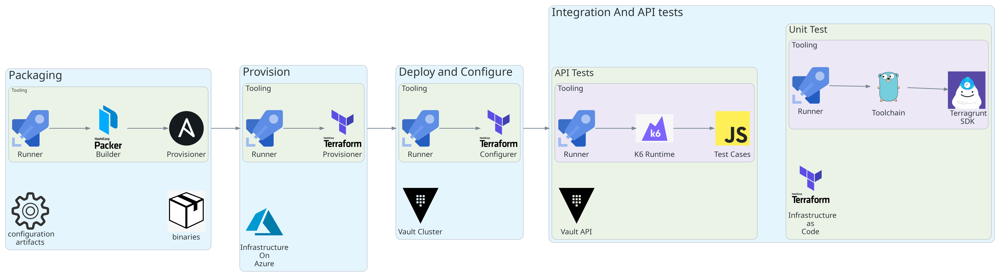
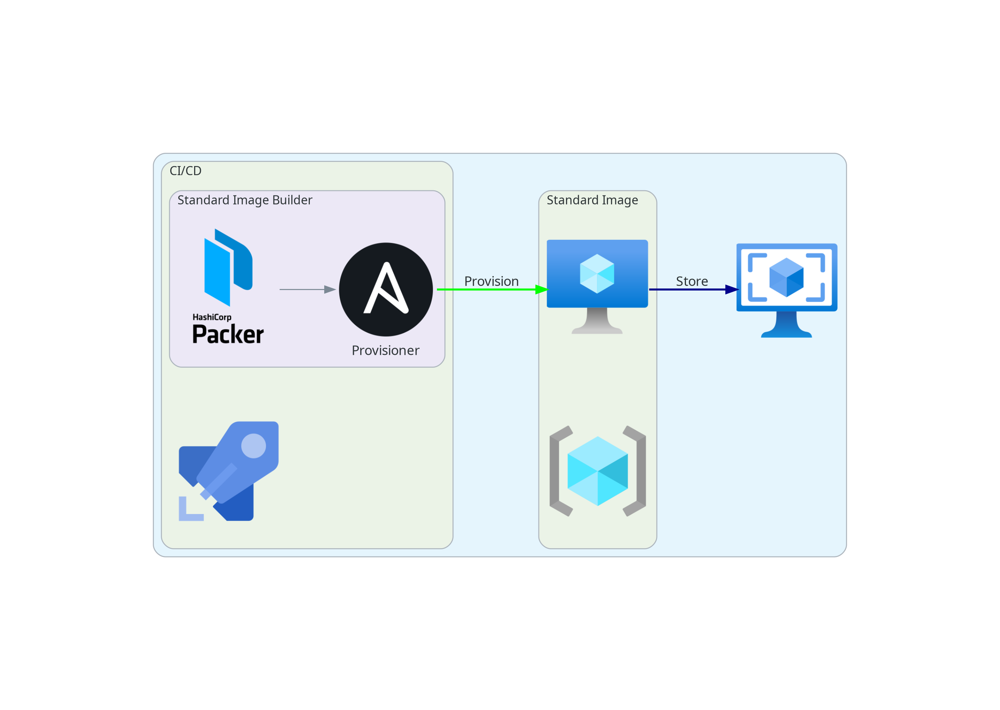
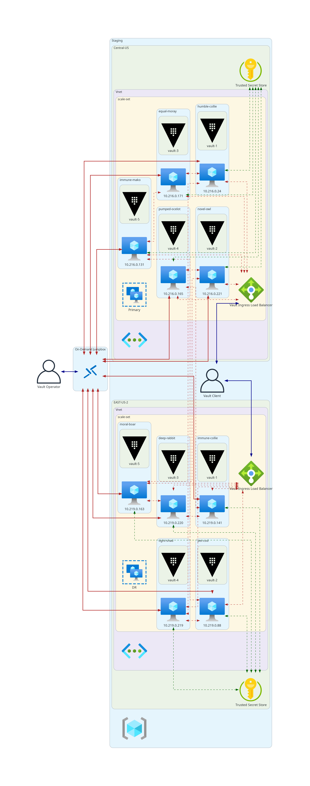
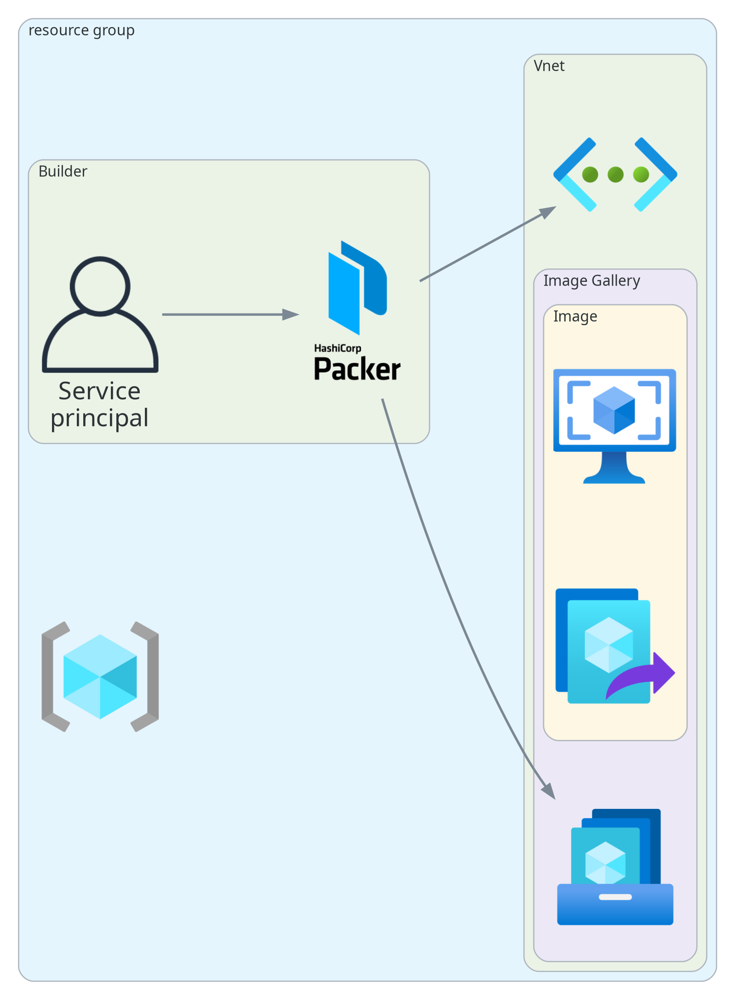
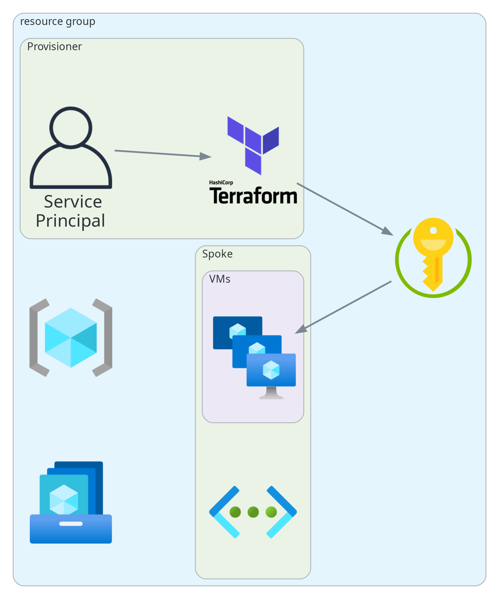

# design-document

- [design-document](#design-document)
  - [Overview](#overview)
  - [Packaging](#packaging)
    - [Packaging : Overview](#packaging--overview)
    - [Packaging : Diagram](#packaging--diagram)
    - [Packaging : Automation and Workflow Development Plan](#packaging--automation-and-workflow-development-plan)
    - [Packaging : implementation details](#packaging--implementation-details)
  - [Provision](#provision)
    - [Provision : Overview](#provision--overview)
    - [Provision : Diagram](#provision--diagram)
    - [Provision : Automation and Workflow Development Plan](#provision--automation-and-workflow-development-plan)
    - [Provision : implementation details](#provision--implementation-details)
  - [Deploy and Configure](#deploy-and-configure)
    - [Deploy and Configure : Overview](#deploy-and-configure--overview)
  - [Test](#test)
    - [Unit Tests](#unit-tests)
    - [API Tests](#api-tests)
  - [Security](#security)
    - [Security : Packaging](#security--packaging)
    - [Security : Provision](#security--provision)
  - [References](#references)

<div style="page-break-after: always; visibility: hidden">\pagebreak</div>

## Overview

This document aims to expand and describe different stages and tasks in
each step that need to be completed to deploy the Vault cluster
following the SOW presented to GM Financial.



We cover the following stages ( `Epics` ) of the software delivery
lifecycle

-   Packaging: We include all required binaries and configuration
    artifacts in the form of Standard image
-   Provision: The vault cluster requires a running environment and
    infrastructure. This infrastructure runs on Microsoft Azure.
-   Deploy and Configure: Setup and configuration of various Vault auth
    methods and secret engines.
-   Test: Creation of Terraform unit-tests with
    [`terratest`](https://terratest.gruntwork.io) framework and
    different API test scripts with [`k6`](https://k6.io)

<div style="page-break-after: always; visibility: hidden">\pagebreak</div>

## Packaging

### Packaging : Overview

In the packaging phase, we use Hashicorp's `Packer` with `Ansible`
provisioner to create a Standard Image based on **hardened** RHEL,
approved by GMF's cybersecurity department. This Standard image Contains:

-   Splunk Agent for log collection
-   Vault Enterprise with License and associated configuration artifacts
-   Bash scripts that set up DR cluster and render templated Vault
    configuration artifacts.
-   [Goss](https://github.com/aelsabbahy/goss) Binary and config file
    for confirmation and testing of the image at the end of the creation
    process

### Packaging : Diagram



### Packaging : Automation and Workflow Development Plan

The following is the workflow details for developing and troubleshooting
**image build** in the **Dev** environment and can be replicated in
other environments:

-   Have the **DevOps** team create an `Azure Compute Gallery Resource`
    in the `deployment` resource group.
-   Have the **DevOps** team create a `Dev Image Gallery Builder`
    Managed Identity.
-   Use a `Dev Image Gallery Builder Managed Identity` for
    troubleshooting builds and deployments into **Dev**
    `Azure Compute Gallery`.
-   `Dev Image Gallery Builder` Managed Identity has minimal required
    access permission level on **Dev** `Azure Compute Gallery` , much
    like the example provided by **DevOps** team.
-   The deployed Vault image needs access to Azure resources (e.g.,
    before `vault` service starts, we would run a script that pulls tls
    key-pair from Azure Key Vault), so we need to have the VM Images
    created with a system assigned or User Assigned Managed Identity and
    secure their runtime access by providing access to the Managed
    Identity(s) to enable this access.

<div style="page-break-after: always; visibility: hidden">\pagebreak</div>


### Packaging : implementation details

We use test-driven development ([`TDD`](tdd)) process, which leverages
`goss`. The following are the requirements:

-   Azure CLI must be installed and available in `PATH`.
-   Ensure that Linux firewall (e.g `IPTables` ) allows ingress for the
    following ports:
    -   `8200`: Vault API , Cluster bootstrapping and Vault UI
    -   `8201`: Raft, replication, request forwarding
    -   `22`: SSH connection
-   Vault binary must be in user's `PATH` , under `/usr/local/bin` and
    ensure it is executable.
-   Create `vault` system user and group and ensure it does not have a
    shell so no human entity can login as `vault`
-   Vault Data Directory
    -   Location : `/var/vault/data`
    -   Ownership : `vault` user/group.
    -   Stores Raft HA storage data after Vault starts
-   Static Vault Configuration directory:
    -   Location : `/etc/vault.d`
    -   Ownership : `vault` user/group.
    -   Include any 'static' (not-templated) Vault configuration
        artifacts.
    -   Files:
        -   [`/etc/vault.d/listener.hcl`](https://www.vaultproject.io/docs/configuration/listener/tcp):
            stores configuration for setting up Vault TLS listener.
        -   [`/etc/vault.d/telemetry.hcl`](https://www.vaultproject.io/docs/configuration/telemetry):
            stores configuration that tells Vault to export metrics in
            `Prometheus` format.
        -   [`/etc/vault.d/replication.hcl`](https://www.vaultproject.io/docs/configuration/replication):
            stores configuration parameters for tuning replication
            related values.
-   Templated Vault Configuration Directory :
    -   Location: `/var/vault.d`
    -   Ownership : `vault` user/group.
    -   Include templated configuration artifacts; i.e artifacts that
        require values that are only known after a VM is created based
        off of this standard image, such as Cluster node IP addresses
    -   Templated artifacts have `tmpl` extension; e.g
        `/var/vault.d/foo.hcl.tmpl`
    -   Files:
        -   [`/var/vault.d/seal.hcl.tmpl`](https://www.vaultproject.io/docs/configuration/seal/azurekeyvault):
            Stores templated config for auto unseal with Azure Key Vault
        -   [`/var/vault.d/raft.hcl.tmpl`](https://www.vaultproject.io/docs/configuration/storage/raft):
            Stores templated config file for using built in Raft HA
            storage.
        -   `/var/vault.d/config-root.hcl.tmpl`: Stores configuration
            directives that do not belong to any stanzas such as `ui`
-   Vault Server TLS certificates
    -   Location: `/etc/vault.d/tls`
    -   Ownership : `vault` user/group.
-   Script that renders templated Vault configuration artifacts :
    -   Location: `/usr/local/bin/render-vault-config`
    -   Must be executable
    -   This script would use `envsubst` to render templated
        configuration artifacts under `/var/vault.d` and store the final
        result in `/etc/vault.d/`
    -   After rendering templates, The following must exist in Vault
        config directory
        -   `/etc/vault.d/listener.hcl`
        -   `/etc/vault.d/telemetry.hcl`
        -   `/etc/vault.d/replication.hcl`
        -   `/etc/vault.d/seal.hcl`
        -   `/etc/vault.d/raft.hcl`
        -   `/etc/vault.d/config-root.hcl`
-   Vault Certificate init script
    -   Location: `/usr/local/bin/init-vault-tls`
    -   Must be executable
    -   This script would pull CA and tls key-pair from a trusted source
        and stored them in `/etc/vault.d/certificates`
    -   After pulling the certificates, the following files must be
        created
        -   `/etc/vault.d/tls/ca.pem`
        -   `/etc/vault.d/tls/cert.pem`
        -   `/etc/vault.d/tls/key.pem`
-   Vault DR cluster setup script
    -   Location: `/usr/local/bin/vault-dr-cluster-setup`
    -   Ownership : `vault` user/group.
    -   This script runs after Vault daemon starts and sets up Vault DR
        cluster
-   Use `SystemD` to manage Vault daemon:
    -   Hardened unit file:
        -   Prevent Privilege escalation
        -   Disable swap
    -   Uses `vault` system user/group
    -   Uses `ExecStartPre` directive to run
        `/usr/local/bin/init-vault-tls` before running `vault`
    -   Uses `ExecStartPre` directive to run
        `/usr/local/bin/render-vault-config` before running `vault`
    -   Uses `ExecStartPost` to run
        `/usr/local/bin/vault-dr-cluster-setup` script after starting
        `vault`
    -   Ensure that it is **enabled** ( not **started** )
-   [`Splunk`](https://docs.splunk.com/Documentation/Splunk/8.2.6/Data/CollecteventsfromJournalD)
    configuration to read logs from `journald`

<div style="page-break-after: always; visibility: hidden">\pagebreak</div>

## Provision

### Provision : Overview

We use Hashicorp's `Terraform` to automate the acquisition and
management of Azure infrastructure. We are assuming the following:

-   An Azure `Resource Group` has already been created for our team.
-   Vault Server CA and TLS key-pair has been stored in Azure Key Vault. The
    SystemD unit starting Vault process runs `init-vault-tls` script that we
    have already included in the Standard image to pull/update certificates from
    Azure Key Vault before it starts Vault process
-   VNets for **Primary** and **DR** regions
    -   `Central-US`: resources deployed in **Primary** cluster region
    -   `EAST-US-2`: resources deployed in **DR** cluster region

We must also ensure required network security rules are in place:

-   Allow intra-cluster communication on port `8201`
-   Allow incoming requests on port `8200`
-   Ensure all other traffic is blocked

Vault daemon will run on [Linux Virtual Machine Availability
Set](https://docs.microsoft.com/en-us/azure/virtual-machines/availability-set-overview)
with `five` instances. The following is Hashicorp's VM spec [recommendations](https://learn.hashicorp.com/tutorials/vault/raft-reference-architecture?in=vault/day-one-raft#hardware-sizing-for-vault-servers):

  Size    Instance/VM Types                      Disk Volume Specs
  ------- -------------------------------------- -----------------------
  Small   `Standard_D2s_v3`,`Standard_D4s_v3`    1024GB(`Premium_LRS`)
  Large   `Standard_D8s_v3`,`Standard_D16s_v3`   1024GB(`Premium_LRS`)


All incoming traffic from Clients to Vault goes through [`Azure Load
Balancer`](https://azure.microsoft.com/en-us/services/load-balancer)

### Provision : Diagram



<div style="page-break-after: always; visibility: hidden">\pagebreak</div>

### Provision : Automation and Workflow Development Plan

The following is the workflow details for For developing and
troubleshooting resource deployment in the **Dev** environment and can
be replicated in other environments:

-   Have the **DevOps** team create an `Azure Repo`, associated
    `Azure pipeline`, general access `variables group` or
    `variables file`, and `secrets variable group`.
-   Have the **DevOps** team create a `Dev Environment Builder` Managed
    Identity.
-   Use `Dev Environment Builder` Managed Identity for troubleshooting
    build and deployment from Repo deployment files and **Dev**
    `Azure Compute Gallery` into **Dev** `Resource Group`.
-   Ensure `Dev Environment Builder` Managed Identity has **read-only**
    access to the associated **Dev** `Azure Compute Gallery` and
    permissions to create the Azure resource types needed in your
    deployment. Ensure the permissions are scoped only to the dedicated
    resource group.

### Provision : implementation details

We are leveraging Hashicorp's `Terraform` to automate the acquisition and
management of resources. This phase is broken down into multiple loosely
connected terraform submodules. These submodules independently do not
accomplish any business goals; the **root** module composes them to achieve the
overall goal of provisioning the resources.

The following is a list of those submodules:

- `common-tags`: This is an auxiliary module that generates resource tags used
in the other terraform submodules. It enforces a consistent naming convention
for tagging resources.
- `IAM` : All Vault-related IAM resources are managed in this submodule
- `classic-load-balancer`: This submodule creates and manages a Classic load
balancer for the Vault cluster.
- `vm` : This submodule creates and manages availability set nodes that Vault cluster
runs on.

<div style="page-break-after: always; visibility: hidden">\pagebreak</div>

## Deploy and Configure

### Deploy and Configure : Overview

In this phase, the following are enabled and/or configured:

-   Vault Namespaces
-   Auth Methods:
    -   App Role : Authentication method, primarily used by non-human entities.
    -   JWT/OIDC: Enables authentication with JWT or OIDC provider.
    -   Azure: Enables authentication against Vault using Azure Active
        Directory credentials
- Secret Engines:
    -   KV : Generic Key-Value pair storage
    -   Azure : Enables dynamic generation and lifecycle management of Azure
        service principals along with role and group assignments
    -   PKI: Dynamic generation and management of X.509 certificates

<div style="page-break-after: always; visibility: hidden">\pagebreak</div>

## Test

### Unit Tests

Unit tests are defined based on Deployed engines. they also cover
**provisioning** stage **goss** runs validation and testing at the end
of the **packaging** phase

### API Tests

There are many different types of API load tests. The following is a
summary of them:

-   `Load Testing` : type of Performance Testing used to determine a
    system's behavior under normal and peak conditions. The goal is to
    find out about:
    -   assess the throughput and latency of a system under average, and
        peak conditions
    -   Figure out SLA/SLOs
    -   Ensure SLAs/SLOs are met as the system changes
-   `Stress Testing`: a type of `load testing` used to determine the
    system's limits under extreme conditions. The goal is to find out
    about:
    -   System breaking point and resource utilization at that point
    -   Maximum acceptable request throughput before breaking
    -   Recovery time of the system (if it can recover at all)
-   `Spike Testing`: A type of `Stress test` that sends extreme load
    over a brief period. It can also be classified under
    `chaos experiments`. The goal is to learn about:
    -   system behavior when sudden bursts happen. An example can be
        black Friday when retail systems are under massive load.
    -   Recovery time/process when the load dies down and resource
        allocation patterns.
-   `Soak Testing`: Type of test that focuses on system reliability.
    Think of this as a load test that runs continuously for a reasonably
    long time. Some example reliability issues include:
    -   Issues due to runtime bugs
    -   Memory leaks
    -   Insufficient storage quotas,
    -   Incorrect/poor configuration
    -   infrastructure failures

<div style="page-break-after: always; visibility: hidden">\pagebreak</div>

## Security

### Security : Packaging



Our Vault image is based on hardened CIS Images.
All operations that interact with cloud resources have to go through Azure DevOps pipelines.
`Packer` uses `Azure Active Directory Service Principal`, and the following Azure
`Actions` permissions in the `distribution resource group` is granted:

- Permission to customize existing images
  - `Microsoft.Compute/galleries/read`
  - `Microsoft.Compute/galleries/images/read`
  - `Microsoft.Compute/galleries/images/versions/read`
- Allow VM Image Builder to distribute images **within** the **distribution resource group**:
  - `Microsoft.Compute/images/write`
  - `Microsoft.Compute/images/read`
  - `Microsoft.Compute/images/delete`
- Allow distribution to Azure Compute Gallery:
  - `Microsoft.Compute/galleries/images/versions/write`
- Permission to customize images on your virtual networks
  - `Microsoft.Network/virtualNetworks/read`
  - `Microsoft.Network/virtualNetworks/subnets/join/action`

<div style="page-break-after: always; visibility: hidden">\pagebreak</div>

### Security : Provision



All operations that interact with cloud resources have to go through Azure
DevOps pipelines.

`Terraform` uses `Azure Active Directory Service Principal`, and the following Azure
`Actions` permissions in the `distribution resource group` are granted:

- resource group RBAC that allows for the creation of VMs while blocking `VNet` creation

```json
{
  "permissions": [
    {
      "actions": [
        "*",
        "Microsoft.Compute/virtualMachines/*",
        "Microsoft.Compute/virtualMachineScaleSets/*"
      ],
      "dataActions": [],
      "notActions": [
        "Microsoft.Authorization/*/Delete",
        "Microsoft.Authorization/*/Write",
        "Microsoft.Authorization/elevateAccess/Action",
        "Microsoft.Network/dnsZones/write",
        "Microsoft.Network/dnsZones/delete",
        "Microsoft.Network/dnsZones/*/write",
        "Microsoft.Network/dnsZones/*/delete",
        "Microsoft.Network/virtualNetworks/write",
        "Microsoft.Network/virtualNetworks/delete",
        "Microsoft.Network/virtualNetworks/peer/action",
        "Microsoft.Resources/subscriptions/resourceGroups/write",
        "Microsoft.Resources/subscriptions/resourceGroups/delete"
      ],
      "notDataActions": []
    }
  ]
}
```

- The VNet needs to have an RBAC with the following permissions to allow VMs to join

```json
{
  "permissions": [
    {
      "actions": [
        "Microsoft.Network/publicIPAddresses/join/action",
        "Microsoft.Network/virtualNetworks/subnets/join/action",
        "Microsoft.Network/virtualNetworks/subnets/write",
        "Microsoft.Network/virtualNetworks/*/join/action",
        "Microsoft.Network/networkSecurityGroups/write",
        "Microsoft.Network/networkSecurityGroups/securityRules/write",
        "Microsoft.Network/networkSecurityGroups/securityRules/delete"
      ],
      "dataActions": [],
      "notActions": [],
      "notDataActions": []
    }
  ]
}
```

- The VMs also need to be able to read from Azure Key Vault. We can use
`Key Vault Secrets User` built-in role with
`4633458b-17de-408a-b874-0445c86b69e6` ID.

- For Vault To perform auto-unseal, it requires the following built-in roles:

| Built-in role	name        |  Role ID                                |
| ---------------           |  ---------------                        |
| `Key Vault Secrets User`  |  `4633458b-17de-408a-b874-0445c86b69e6` |
| `Key Vault Crypto User`   |  `12338af0-0e69-4776-bea7-57ae8d297424` |


<div style="page-break-after: always; visibility: hidden">\pagebreak</div>

## References

- [Packer Authentication for Azure](https://www.packer.io/plugins/builders/azure#authentication-for-azure)
- [Configure Azure VM Image Builder permissions by using the Azure CLI](https://docs.microsoft.com/en-us/azure/virtual-machines/linux/image-builder-permissions-cli)
- [Azure built-in roles](https://docs.microsoft.com/en-us/azure/role-based-access-control/built-in-roles)
- [Create an Azure Image Builder template](https://docs.microsoft.com/en-us/azure/virtual-machines/linux/image-builder-json)
- [Azure Image Builder Service Image Creation Role JSON](https://raw.githubusercontent.com/azure/azvmimagebuilder/master/solutions/12_Creating_AIB_Security_Roles/aibRoleImageCreation.json)
[Azure security baseline for Virtual Machine Scale Sets](https://docs.microsoft.com/en-us/security/benchmark/azure/baselines/virtual-machine-scale-sets-security-baseline)
- [Azure built-in roles for Key Vault data plane operations](https://docs.microsoft.com/en-us/azure/key-vault/general/rbac-guide?tabs=azure-cli#azure-built-in-roles-for-key-vault-data-plane-operations)
- [Hashicorp Learn: Auto-unseal using Azure Key Vault](https://learn.hashicorp.com/tutorials/vault/autounseal-azure-keyvault)
<!-- https://stackoverflow.com/questions/53012713/what-is-the-difference-in-rbac-for-vms-vs-vm-scale-sets -->
