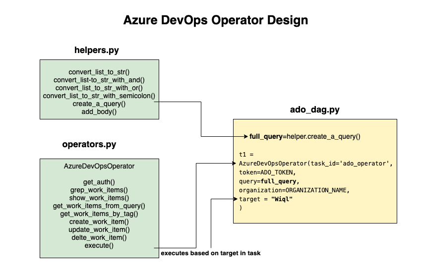
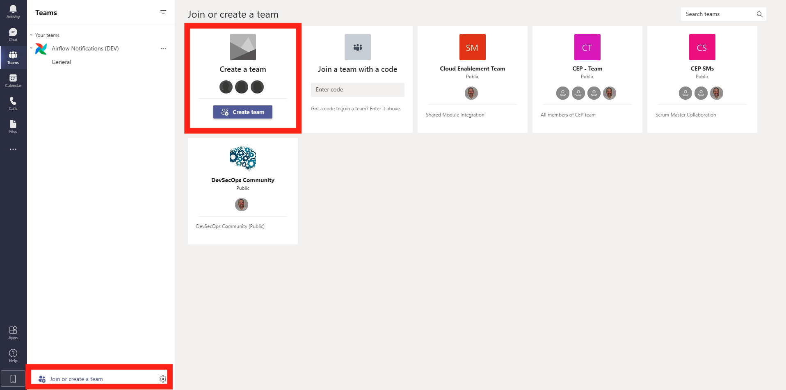
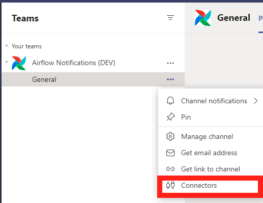
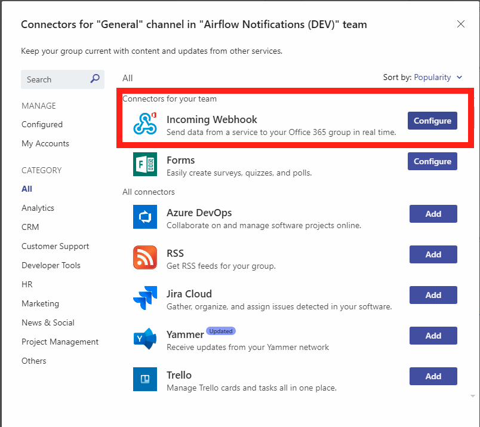
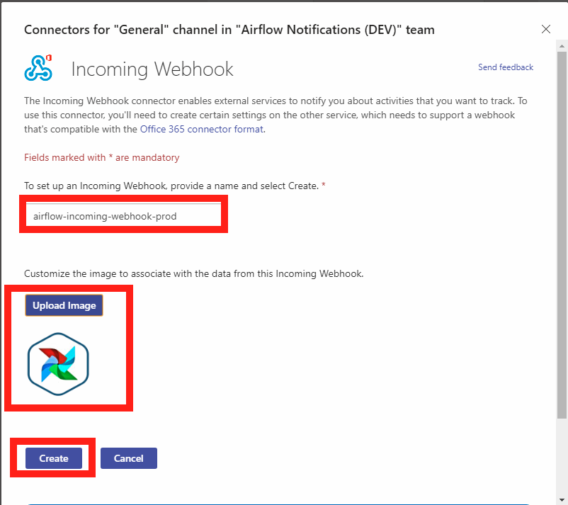
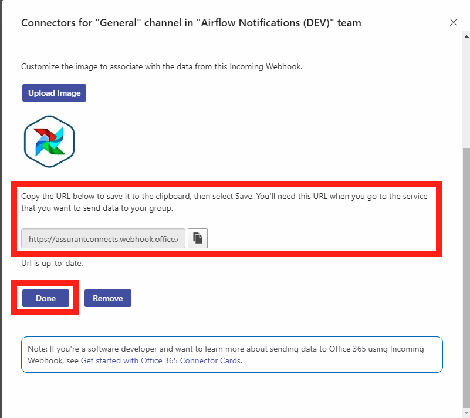
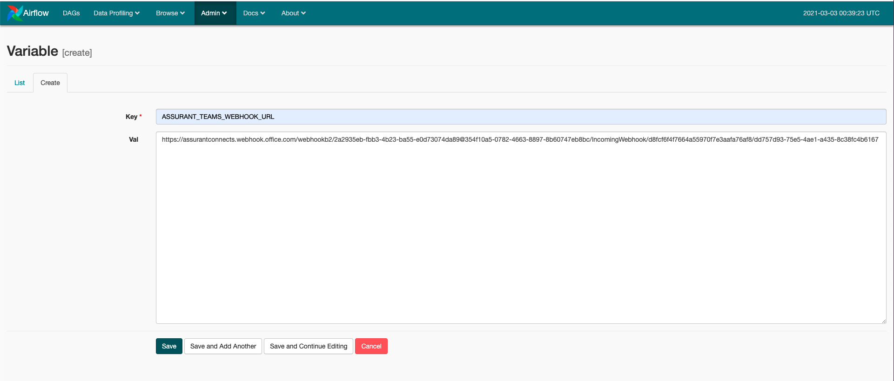

# Operators & Helpers Design

The Operators & Helpers contained within this **/libraries** directory are Assurant's core Airflow Operators from which other DAGs may inherit, including the modules distributed in provider packages.

The **/dags** directory contains example dags to give you an idea on how to design and structure your own dags in a separate repository that will use these operators as a source of truth based on a specific git version tag.

 

 

# ADO Operator Setup From Scratch - ado_operator.py

Overall the setup of this Azure DevOps Operator is straightforward ans was built from scratch by using basic CRUD operations to call the ADO API.

Below is a list of functions ado_operator.py used to authenticate and call ADO to get work items, so that these functions can be inherited by any DAGs from any repository that pulls in this repository and its associated git version tag.

## List of functions

| Function          | Description |
| --------------- | ----------- |
| def __init__      | Constructor that initializes arguments specifically related to ADO Operator functionality  |
| get_auth(self)      | Gets Azure DevOps organization authorization       |
| def get_all_work_items_from_query(self, query, wit_client)    | Runs a query on work items and sends result to get_work_items_metadata()  |
| get_work_items_metadata(self, work_items, **context)  | Gets all work items data based on a query result from get_all_work_items_from_query   |
| get_work_item_by_id(self, client) | Gets work item based on work item ID passed in by client |
| create_work_item(self, client)    | Creates a new Azure DevOps work item  |
| _create_work_item_field_patch_operation(self, op, field, value)   | Used by to append fields to new work items or update work items |
| _create_patch_operation(self, op, path, value, *args, **kwargs)   | Used by _create_work_item_field_patch_operation() to allow for adding proper fields formatting    |
| update_work_item(self, client)    | Updates a specific work item by ID passed in by client   |
| delete_work_item(self, client)    | Deletes a specific work item by ID passed in by client   |
| execute(self, context)    | Main execution function that triggers all the other functions based on DAG client calls to it |

 

---

 

# Team Operator Setup From Scratch - teams_operator.py

## Create a team

While in Teams, at the bottom of the left column clicn on **Join or create teams**

## Click Connectors

After you created a new team, in the General channel (or in a new channel) click on the ellipsis and select **Connectors**

## Configure Incoming Webhook

In the popup screen that appears at the top of the list, click on **Configure** button for **Incoming Webhooks**

Create your webhook name and upload an Airflow image that is small in size using this logo (airflow_logo.png) in /images directory is small enough to work well.

Click on **Create** button.

Copy the webhook URL and paste it in Airflow Server UI variables section: Admin -> Variables

Go to Admin -> Variables and click Create and past in Key & Value:

Below is a short list of Team Operator functions and what they do.

| Function          | Description |
| --------------- | ----------- |
| def __init__      | Constructor that initializes arguments specifically related to Teams Operator functionality  |
| build_message(self)      | Created the Teams json payload card with parameters to be interpolated by values passed in from the DAG that calls it       |
| execute(self, context)    | Main execution function that triggers all the other functions based on DAG client calls to it |

---

# Future Development of this Feature 

The expectation for testing is to have a single Teams channel to send all notifcations to, but for MODEL (production) the intention is to send Teams notifications to the owner channels and to the the requestor's channels as well for high visability. This operational process needs to be explored and discussed in the future.

## **TODO:** **VDC Onboarding:** 

**TEAMS**
---
1.) Need to pass in owners list from ServiceNow Payload into owners list in vdc_dag.py and for each particular step pass in the owner that need a Teams notification sent to thier Teams channel within Assurant. Each VDC onboarding step has an owner and requestor. There could be many owners but only one requestor. In production (MODEL) these notifications should be sent to specific and unique channels in Teams of which own a particular task in the VDC onboarding process.

**ALL STEPS**
2.) Each and every step will need to be analyzed to map the human process that is currently being used for VDC Onboarding so that it can first be determined if it can be optimized for efficiency and then how to implement this into Airflow. There are 20 steps, some steps are more complex than others. Lots of collaboration, meetings and analysis with Assurant will need to take place in order to ensure accuracy.

**ado_operator.py**
3.) For each step more precise development will be needed for ado_operator.py within the *execute()* function on line 353. This section defines each step number and the unique values that are needed for each step such as owners, team members, application name, etc, which are all contained in the initial payload which is step 1 coming from ServiceNow, but for local development comes from manually triggering in the docker container via command line. This process can be found in the README in the *dags* directory.

Another issue to look to into is when the dyanmic dag creator is running with schedule set to @hourly, this if you started a DAG run and then the local time hits the top of the hour then a new dag run will be triggered. Some additional logic needs to be re-worked in the ado_oeprator to remediate this.

On line 174 there is if statement that returns an error when the tag is equal to  'request_denied' which means a Worksloads Adoption work item was submitted and the tag put in by the CEP Teams was 'request_denied' and then the task for this DAG fails. We are sure this is the not best way to handle the conditional operation of a denied Workloads Adoption request. The problem this this is the parent Epic ticket that is the parent to the child work item, which is the Request (being denied), remains open and will need to be manually closed, but it a request is approved (by simply closing the Request ticket) the tasks succeeds and proceeds to the next task in the Worksloads Adoption DAG. More developmebnt needs to be focused on how to handle this scenario of when a request is denied and then the parent work item EPIC is closed.  

---

## **TODO:** **Worksloads Adoption:** 

**TEAMS**
---
1.) Need to pass in owners, which are essentially a team and this team is what will be notificed using the Teams notification task. So somewhere in the code need to find a way to let every TeamsOperator task know which Teams channel to send the notification to. At this point we are specifying the Teams channel using the TEAMS_WEBHOOK_URL but this goes to our DEV and MODEL testing channels in Teams. In production (MODEL) these notifications should be sent to specific and unique channels in Teams of which own a particular task in the Workloads Adoption process.

**STEP 3: Terraform Enterprise Onboarding**
--
2.) There will be further investigation and meetings required with Assurant to determine the exact process for onboarding to Terraform Enterprise and how Airflow can automate it.

**STEP 4: Backlog**
--
3.) There will be further investigation and meetings required with Assurant to determine the exact process for grooming backlog work items and how Airflow can automate and track the process.

**STEP 5: Spoke Services Alignment & Delivery**
--
4.) There will be further investigation and meetings required with Assurant to determine the exact process for Spoke Services Alignment & Delivery work items and how Airflow can automate it.

**STEP 6: Stakeholder Feedback**
--
5.) There will be further investigation and meetings required with Assurant to determine the exact process for Stakeholder Feedback work items and how Airflow can automate and track the process.
