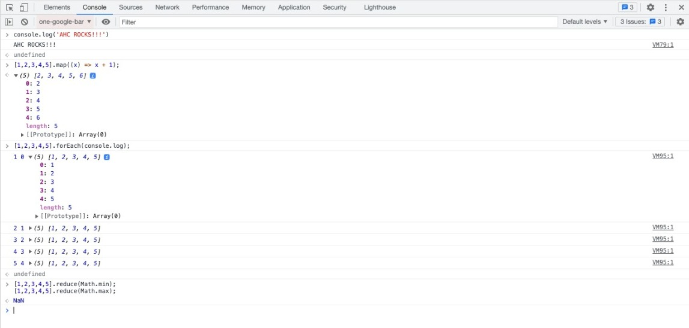

# DOU by Tech Mahindra

## AHC Training Week 3

#### Basic JS and JSON
#### Fetch API and DOM Manipulation 
#### ES6 Syntax

<br/>
<br/>
<br/>
<br/>

### WEEK ALGORITHM

This problem was asked by Google.

The edit distance between two strings refers to the minimum number of character insertions, deletions, and substitutions required to change one string to the other. For example, the edit distance between “kitten” and “sitting” is three: substitute the “k” for “s”, substitute the “e” for “i”, and append a “g”.

Given two strings, compute the edit distance between them.

input 
“kitten” “sitting” 

output 
3

input 
typing “riding” 

output 
3

### WEEK EXCERCISE
At the end of the week you must have the following, this is the entire image
 ✅
<br/>

but in parts it should look like this

remember is the same content but closer


### Requirements

Layout very similar, when you click on the central image you need to change it for one of the collection below every time, and move forward, first click, the first one, second, the second one and so on and so forth when you run out of them, return to the default image ✅

when the button send is clicked you need to collect all the information from the form and display it below the image, remeber to use html validations for that ✅

the right buttons on the nav bar needs to send you to specific sides of the page, like about, contact and home ✅

### JS BASICS

#### Questions
* what is an array?
The array is a variable that can store several values of a single category 
* what is an object in js?
The objects are variables that they can store several values
* what is the prototype and classes and how they are different?
a) prototype: Is an object used to inherit methods and properties from the objects
b) class: is a template in order to create objects
* what are is let, const and var and what are their differences?
The three ones are variables that store values
a) let: is a variable that could change
b) const: is a variable that don't change 
c) var: is a global variable
* what is a promise?
Is the response of a request that could be executed or rejected
* what is undefined and null values for?
Undefined is a value that is not already declared and null is a empty value 
* what is the scope of a variable?
Is the visibility that a variable have it, normally is represented with {}
* explain very simple the event loop?
Are used to run a block of code several times, each time with a different value
* what is a constructor?
Is a method to create an object from a class

####  Exercises

Execute code in the console of any web page by f12 or right click inspect and in console start typing the following

```
console.log('AHC ROCKS!!!')
```

Very handy arrays,

explore the different ways to iterate over arrays

check the following

```
[1,2,3,4,5].map((x) => x + 1);
```
check the following

```
[1,2,3,4,5].foreach(console.log);
```

check the following

```
[1,2,3,4,5].reduce(Math.min);
[1,2,3,4,5].reduce(Math.max);
```



* write a piece of code on how you add values to an array at the end ✅
* write a piece of code on how you add values to an array at the beggining ✅
* write how do you reference the last value on an array? ✅
* write how can you put dinamyc or calculated properties in a dictionary(object)? ✅

####  References

https://developer.mozilla.org/es/docs/Web/JavaScript/Data_structures ✅
https://developer.mozilla.org/es/docs/Web/JavaScript/EventLoop ✅

### DOM and FETCH API
#### Questions
* What is the dom and what it stands for?
Is a structured representation of HTML documents 
* What is event bubbling and event capture?
a) bubbling event: when a event happens in an element, first runs the origin element, and then goes to the parent element 
b) capture event: when an event happens in an element, runs in the outer elements and then in the target element
* What data structure the dom uses?
A tree structure 
* What is the fetch api?
Is the request method for get information from a API
* What is a promise?
Is the response of a request that could be executed or rejected

#### Exercises

*When a button is clicked display an alert with the text hurray ✅

*Put an input button and when it changes you need to write the same input below the input text but backwards ✅

#### References 
https://developer.mozilla.org/es/docs/Web/JavaScript/Reference/Global_Objects/Promise ✅
https://www.w3schools.com/js/js_htmldom.asp ✅

### ES6 SYNTAX
#### Questions

* How a function can receive optional parameters?
If default parameters are defined, the scope of the default parameters is the parent to the scope created for the function body 
* What is a literal template?
Is a string template that is used to combine expressions with variables
* What are tagged templates?
Are the more advanced form of template literals that can parse template literals with a function
* What are arrow functions, what happens if the arrow function has no body?
Are shorter functions and non-binding of this
* What is destrcturing in js?
Is an expression that allows extract values from the arrays or properties from the objects
* What is async and await words for?
a) async: makes a function return a promise
b) await: makes a function wait for a promise

#### Excersises

*Write how would you combine the following 2 texts in 2 different variables 
first has const x1 = 'Hey dude!';
second has const x2 = 'You are awesome!'; ✅

*Write how would you destructure the following array in 3 variables [1,2,3] ✅

*If you are exploring the following object
```
	{
		person: {
			name: 'John',
			age: 20
		}
	}
```
Trought destructuring how do you get the name? ✅

*Write a very simple api fetch call using async and await ✅

#### References 
https://www.divami.com/blog/top-ecmascript-es6-features-every-javascript-developer-should-know/ ✅
