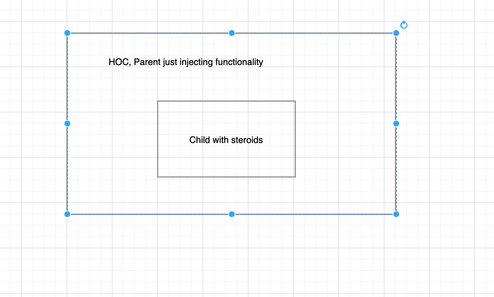
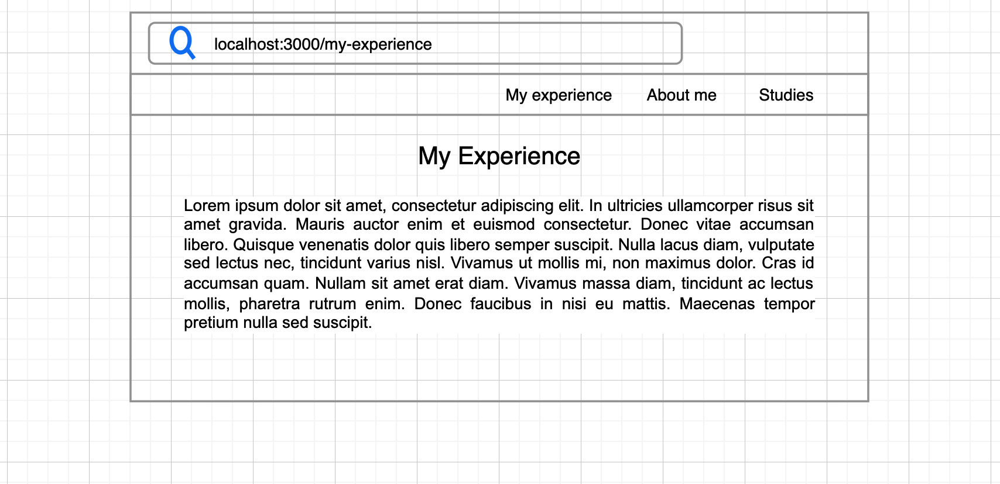
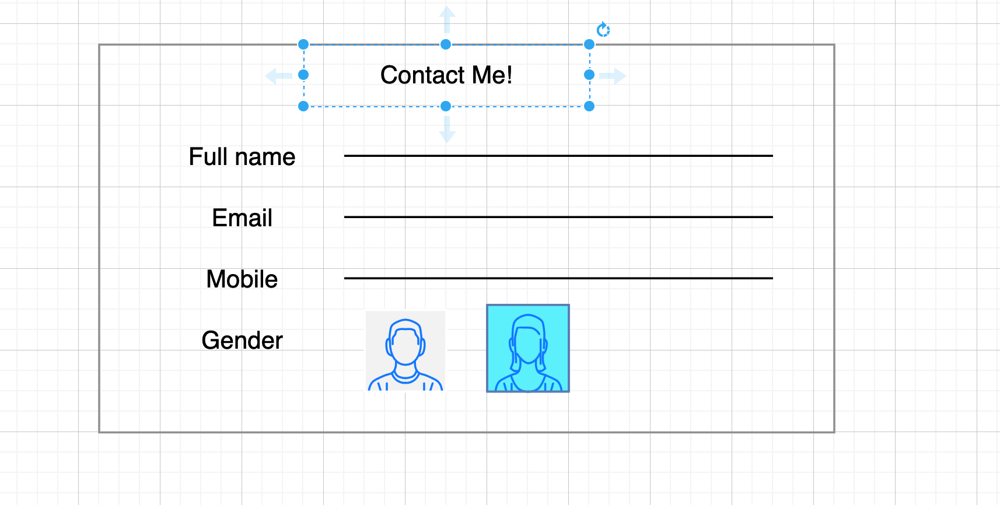

# DOU by Tech Mahindra

## AHC Training Week 7

#### HOCS 

#### ROUTER

#### FORMS

 
 
 
 

This week we will accomplish

- What are HOCS and how to use them
- What is react router and how does it handle routes for you
- How to handle forms in react

### WEEK ALGORITHM
N/A

### WEEK EXCERCISE
N/A

### HOCS

#### Questions

- What are HOCS
- Explain where can you use one?
- What arw high order functions?

#### Exercises

write a simple project react where you subscribe either to a fetch list or to pages dimensions and pass that info down all the way to the child component(You need to create an HOC, basically a component that returns an X component)

#### References
https://es.reactjs.org/docs/higher-order-components.html
https://www.youtube.com/watch?v=9zYNTfOxPMk

### Router

#### Questions

* What is routing?
Is to determine what should shows when a user visits a certain page with a path
* How the server should sync with the client to handle routing?
logging information and timestamps have the accurate time and date
* What are single page applications?
Is an application where you can see all the content just in one page
* What are multi pages applications?
Is an application where pages completely refreshed every time when data changes on them
* What is the hash in a url, what is used for?
Is used in sigle page applications and serves to specify a fragment in the application where the url is going to 

#### Exercises
create throught create react app, an small react application, feel free to use any css library, bootstrap, foundation, material if you need, integrate with it react router, and handle your routes accordingly, you can always make a search to the repo and oficial docs, or check out on the internet, the point of this excercise is to handle 404 route, and routing in a page image you are writing of you resume(portfolio) in main page something about you, other page you experience, other page your studies, etc could be coming in a nav

#### References
https://v5.reactrouter.com/web/guides/quick-start
https://www.youtube.com/watch?v=aZGzwEjZrXc

### Forms

#### Questions

- What is react hook forms and when is good to use it?
Is a library that allows validate forms in React
- Why do we need validation in forms?
Because the input elements from the user needs to be complete and correct before to send them to the server

#### Exercises

Create a contact form that asks for mobile, email, full name, gender, and try to validate it by hand(meaning using no library) when the users use a submit button.

the validations are the following
validate the email contains an `@`
the mobile contains 10 digits,
the gender is selected,
and the full name is not empty

#### References
https://react-hook-form.com/