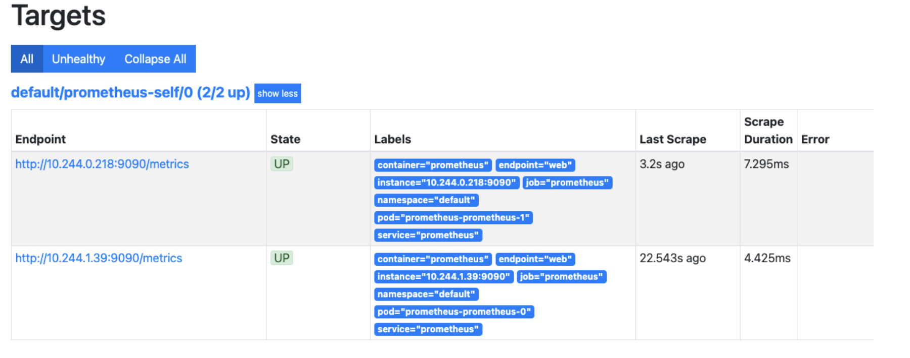
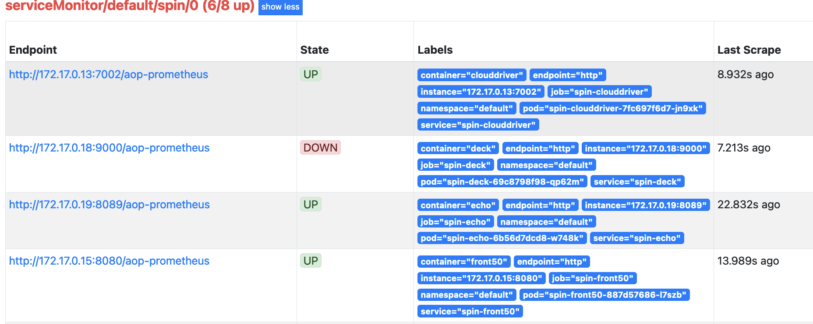
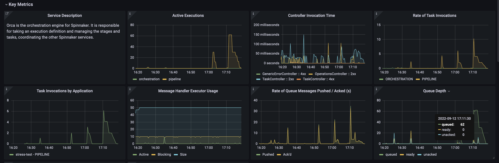

# Newbie Guide to Monitor Spinnaker in a local instance

## Prerequisites
kubectl
Minikube
know how to install and config spinnaker

## cluster

### Create a Kubernetes clustes with Minikube 
```
minikube start -p monitoring-spinnaker --kubernetes-version=v1.20.0 --memory=15g --cpus 7
```

## Prometheus

### Install prometehus CRD's definitions and Operator
NOTE: In this guide we’ll install everything into the default Namespace.

Install the Operator using the bundle.yaml
```
kubectl create -f https://raw.githubusercontent.com/prometheus-operator/prometheus-operator/master/bundle.yaml
```

Configure Prometheus RBAC Permissions
```
kubectl apply -f prom_rbac.yaml
```

Deploy Prometheus
```
kubectl apply -f prometheus.yaml
```

Create a Prometheus Service
```
kubectl apply -f prom_svc.yaml
```

Check prometheus UI
```
kubectl port-forward svc/prometheus 9090
```

If you go to Status -> Targets it should be empty, as we haven’t yet configured anything to scrape.
Lets configure a ServiceMonitor
```
kubectl apply -f prometheus_servicemonitor.yaml
```
After a service monitor is applied it can take up to 1 minute to show on the UI

This service monitor matches with the prometheus service we previously created to scrape using the matchLabels selector with app: prometheus

Port-forward prometheus again and navigate to Targets you should see prometheus scraping pormehteus pod on /metrics path ```kubectl port-forward svc/prometheus 9090```
 

## Spinnaker

### Install and configure spinnaker on default namespace and enable the observavility plugin
Links for reference
Recomend to install oss spinakker as it required less resources
- https://github.com/armory/spinnaker-operator
- https://github.com/armory/spinnaker-kustomize-patches
- https://github.com/armory/spinnaker-kustomize-patches/blob/master/armory/patch-observability.yml

The observavility plugin exposes metrics on /aop-prometheus path

## Scrape /aop-prometheus path

### Configure a ServiceMonitor so prometheus can scrape spinnaker services

```
kubectl apply -f spin-servicemonitor.yaml
```
Port-forward prometheus again and navigate to Targets you should see prometheus scraping spinnaker pods on /aop-prometheuspath ```kubectl port-forward svc/prometheus 9090```
 

## Grafana

### Configure grafana dashboards

Let svc/prometheus being port-forward

clone https://github.com/uneeq-oss/spinnaker-mixin in you directory of preference

Then download the latets release json files of spinnaker-mixin - decompress and move the manifest directory into your local repo of spinnaker-mixin
```
curl -LO https://github.com/uneeq-oss/spinnaker-mixin/releases/download/v0.3.2/spinnaker-mixin-rendered-v0.3.2.tar.gz
```

In spinnaker-mixin project eit grafana-datasources.yaml file url property to:
```yaml
url: http://host.docker.internal:9090
```

Edit Makefile the following echo line:
```
@echo -e "\nPort Forward from Kubernetes with something like: \n
            kubectl port-forward --namespace prometheus svc/prometheus-k8s --address 0.0.0.0 9090 &"
```

Into one line:
`@echo -e "\nPort Forward from Kubernetes with something like:\nkubectl port-forward --namespace prometheus svc/prometheus-k8s --address 0.0.0.0 9090 &"`

### Run grafana
In spinnaker-mixin project
```
make grafana
```
Docker already exposes the port - Navigate to localhost:3000 to see the dashboard

Example see orca-dashboard
 


## Sources
- https://grafana.com/docs/grafana-cloud/kubernetes-monitoring/prometheus/prometheus_operator/ 
- https://github.com/uneeq-oss/spinnaker-mixin
- https://github.com/prometheus-operator/prometheus-operator