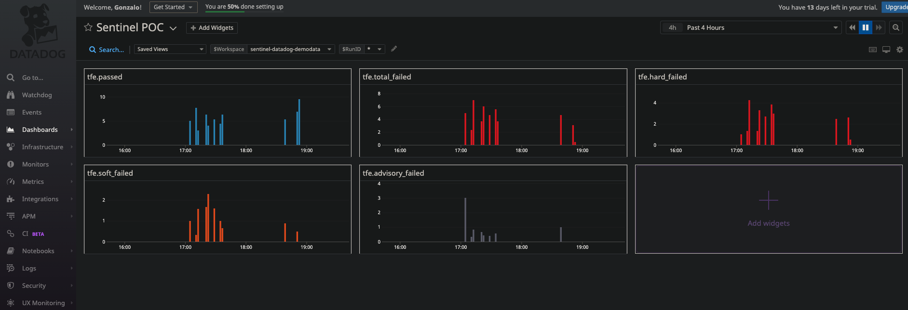
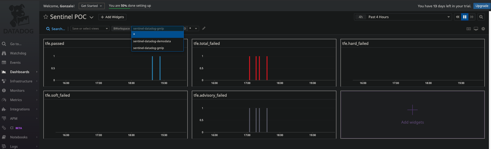

---

# Sentinel DataDog POC

This POC demonstrates how to leverage TFE and DataDog to provide insights about Sentinel Policies.

---

## Filtering by TFE Workspace is also posible!

### Requirements
* TFE Account  
* DataDog Account
---

## How this works?
It uses TFE API to get policy checks and [sentinel-datadog.sh](./sentinel-datadog.sh) script do the magic!. This shell script leverage DataDog API to create custom metrics.