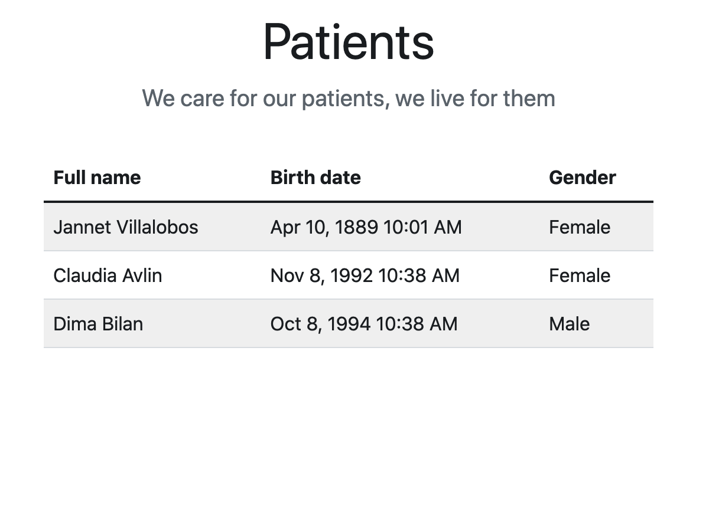

# DOU by Tech Mahindra

## AHC Training Week 5

- React fundamentals
- hooks
- refs


This week we will accomplish

- How react works and the fundamentals of it
- What are refs
- Hooks what are they and how they will help you

<hr />

## WEEK ALGORITHM

Gina plays college basketball and wants to go pro. Each season she maintains a record of her play. She tabulates the number of times she breaks her season record for most points and least points in a game. Points scored in the first game establish her record for the season, and she begins counting from there.

Given the scores for a season, determine the number new scores for Gina meaning every time she breaks her records for <strong>most</strong> and <strong>least</strong> points scored during the season.

Help her out finding them

the score follow this pattern
| Game | Score |
| ----------- | ----------- |
| 1 | 10 |
| 2 | 15 |
| 3 | 10 |
| 4 | 20 |
| 5 | 25 |
| 6 | 5 |
| 7 | 0 |

So in this case she started with 10, from there she scores a new max score with 15, then 10 which is her minimum, meaning no change, then in forth match she scores 20 another time she breaks her limit of the max score, then again in 5th match, then in match 6 she drops her score breaking the min score 1 time, and then another time in match 7

`so the output is [3,2]`
due to she broke her max score 3 times and 2 times her min score

the input will represent the scores she had every game

input

[10,15,10,20,8, 5, 25,0, 20, 10]

output

[3, 3]

<hr />

## PROJECT EXERCISE

You will start building a project in CRA create react app. Use the provided webAPI _(AHC.DevForce.Training)_ as the backend of your application. It contains a single endpoint `https://localhost:44369/api/patients` which you need to consume and print results in a bootstrap table.

Your first task upon this project is to build something like this



you will have to paint a record for each patient and make some conversions, remember to split your components into simpler ones.

### Requirements
- **copy the folder AHC.DevForce.Training into your personal root folder and start from there** _(starting now, the project will grow incrementally each week.)_
- use css
- use bootstrap
- make a table which represents the patients collection
- each patient will have a row and will display full name, full gender and birth date
- display the title of the page and small message 

<hr />

## React fundamentals

#### Questions

- What is react?
- What is the virtual DOM?
- What are is lifecycle of a component?
- How does lifecycle work in class vs functional components?
- What are class components and functional components?
- What is the state in react and what are props?
- What is the display name in a component?
- What is the useState and setState?
- What is the flux pattern?
- What is one way data flow?
- Why is immutability important in react?

#### Exercises

write a simple project react project using create react app
https://create-react-app.dev/
the write the following component

```
import React, { useState, useEffect } from "react";
import { render } from "react-dom";

const SayName = ({name}) => {
  console.log('child');
  return (<section>
    <h1>Hello {name}</h1>
  </section>);
};

const App = () => {
  const [name , setName] = useState();

  const handleChange = ({target: {value}}) => {
    setName(value);
  };

          useEffect(() => {
        console.log('Just running one time');
    }, [])

      useEffect(() => {
        console.log('Running every time my deps(name)');
    }, [name])

  return (
    <section>
      <input type="text" value={name} onChange={handleChange} />
      <SayName name={name} />
    </section>
    );

}

render(<App />, document.getElementById("root"));

```

finally render app as the first node in the tree

What happens when the prop changes?

#### References

https://create-react-app.dev/
https://es.reactjs.org/tutorial/tutorial.html
https://www.youtube.com/watch?v=Dorf8i6lCuk
https://www.youtube.com/watch?v=cSUt8b2qapM

<hr/>

## Hooks

#### Questions

What is a hook?
What are they used for?
How would you write a custom hook and what for?

#### Exercises

Create the following one, use the previous example but this time include a custom hook for managing the name

```
import React, { useState } from "react";
import { render } from "react-dom";

const useName = (initialName = '') => {
  const [name , setName] = useState(initialName);
  console.log('child');
  const handleChange = ({target: {value}}) => {
    setName(value);
  };
  return [name, handleChange];
}
  
  const App = () => {
  
        const [name, handleChange] = useName('John');
  
        console.log('parent', name);
  
        return (
          <section>
            <input type="text" value={name} onChange={handleChange} />
          </section>
          );
  
  }

render(<App />, document.getElementById("root"));

```

look at what happens

#### References

https://es.reactjs.org/docs/hooks-custom.html
https://es.reactjs.org/docs/hooks-intro.html
https://reactkungfu.com/2020/07/hello-react-hooks/#:~:text=React%20Hooks%20were%20introduced%20in,can%20use%20React%20without%20classes.

<hr />

## Refs

#### Questions

- What are refs in functional components?
- What are dom refs in react?
- Mention a use case?

#### Exercises

Follow the next structure

```
import React, { useRef, useEffect } from "react";
import { render } from "react-dom";

const App = () => {
        const ref = useRef(null);
  
        useEffect(() => {
          console.log(ref.current);
          ref.current.style = `
          background-color: red;
          height: 800px;
          width: 100%;
          `;
        }, [])
  
        return (
          <section ref={ref} style={{
            height: '200px',
            width: '200px'
          }}>
          </section>
          );
      }

render(<App />, document.getElementById("root"));

```

#### References
https://es.reactjs.org/docs/hooks-reference.html#useref
https://rogerdudler.github.io/git-guide/
